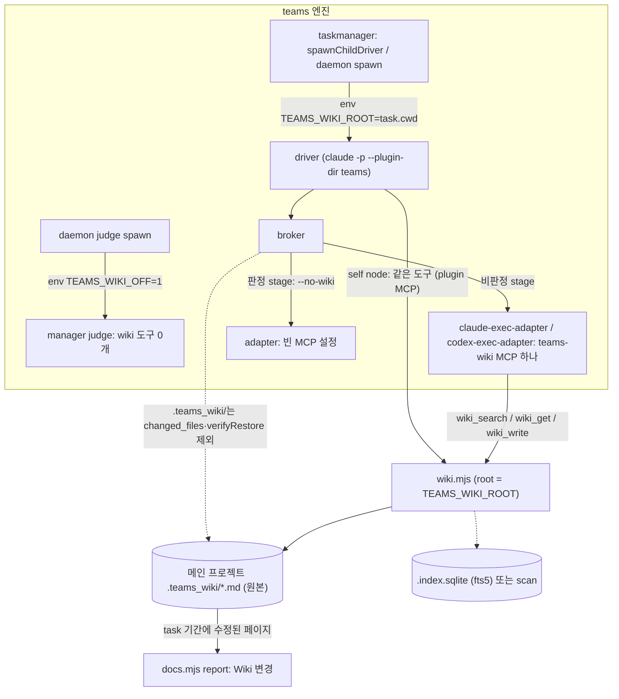

# teams wiki — 세션을 넘는 장기 메모리 (2026-10-07)

> 상태: 1단계 v0.42.0, 1b·2단계 v0.44.0, 3단계 v0.47.0, 4단계 v0.49.0, 5단계(§8) v0.50.0 출시, 5단계 실측 완료. codex 실측은 보류.
> 근거 문서: `2026-09-28-teams-cards-everywhere.md` (Principles 1–5), `2026-09-17-teams-team.md` §6b
> ("새 층이 메모리 상태를 만든다" 금지).
> 선례: `knowledge/scripts/sqlite-knowledge.mjs` (node:sqlite + FTS5 + BLOB 벡터 + JS cosine).

## 1. 문제

EPIC이 끝나면 지식이 사라진다. `docs.mjs`가 `10-prd.md`·`60-qa.md`를 남기지만 엔진은 다시 읽지 않고
(`docs.mjs:1-3`), 사람이 내린 `decisions[]`는 같은 subgoal의 재시도에만 이어진다. 다음 EPIC은 같은
질문을 다시 묻고 같은 결정을 다시 내린다.

목표: 사람의 Confluence처럼 **페이지 단위로 쌓이고, 사람이 읽고 고칠 수 있고, 다음 세션이 검색해 인용하는**
장기 메모리.

## 2. Plan

### 1단계 — MCP 서버 `teams-wiki` (teams와 독립적으로 동작)

- **원본 = md 파일.** `<project>/.teams_wiki/<space>/<slug>.md`, git 추적. frontmatter:
  `title, space, tags, source, updated, status(accepted|superseded), superseded_by`.
  사람이 직접 열어 보고 고쳐도 된다 — 그게 "사용자에게 보이는 산출물"이다.
- **인덱스 = 버릴 수 있는 부산물.** `.teams_wiki/.index.sqlite` (`.teams_wiki/.gitignore`로 제외).
  md mtime이 바뀌면 다시 색인한다. 지워도 md에서 똑같이 재생성된다.
- **검색 = SQLite FTS5만. 벡터·임베딩 없음** (2026-10-07 사용자 결정: Ollama 안 씀, 외부 모델 의존 없음).
  한국어는 FTS5 trigram + 2음절 prefix (knowledge의 방식 그대로). 찾는 것보다 **이어지는 것**이 핵심이다.
- **이어짐 = 링크 그래프.** 페이지 본문의 `[[space/slug]]`를 파싱해 sqlite `links(from, to)` 테이블에 둔다.
  - `wiki_get`은 전문과 함께 **나가는 링크·백링크**(제목 한 줄씩)를 돌려준다 — 한 페이지를 열면 이웃이 보인다.
  - `wiki_propose`는 본문에 링크가 하나도 없고 비슷한 기존 페이지(FTS 상위)가 있으면 경고한다 — 고립 페이지 방지.
  - 깨진 링크(없는 페이지를 가리킴)는 `wiki_status`가 목록으로 낸다.
- **컨텍스트 유실 방지 = 이어받기 페이지.** 세션(EPIC) 하나가 끝날 때 `log/<날짜>-<source>` 페이지를 남긴다:
  무엇을 결정했고, 무엇이 열려 있고, 어떤 페이지를 읽고/고쳤는지 — 모두 `[[링크]]`로.
  다음 세션은 `wiki_resume()` 한 번으로 최근 log 페이지와 그 링크 1-hop을 받는다. 처음부터 다시 묻지 않는다.
- **`INDEX.md`(렌더 뷰).** 페이지마다 한 줄 `[[id]] — 요약`. 수락 때마다 다시 쓴다. 사람에게는 목차, 모델에게는 지도.
- **도구 8개.**

  | 도구 | 하는 일 |
  |---|---|
  | `wiki_search(query, space?, k=5)` | FTS 검색. id·title·snippet. superseded는 기본 제외 |
  | `wiki_get(id)` | 페이지 전문 + 나가는 링크 + 백링크 |
  | `wiki_resume(k=3)` | 최근 log 페이지 k개 + 그 링크 1-hop (제목·요약) — 세션 시작용 |
  | `wiki_list(space?)` | space/페이지 트리 |
  | `wiki_propose(space, slug, title, body, source, supersedes?)` | `_proposed/`에 제안 작성, 기존 페이지와의 diff·고립 경고 반환 |
  | `wiki_accept(proposal_id)` / `wiki_reject(proposal_id, reason)` | 제안 반영(재색인·INDEX 갱신) / 거절 사유 기록 |
  | `wiki_status()` | 페이지 수, 인덱스 신선도, 깨진 링크 |

- **쓰기는 항상 제안 → 수락.** 작성자가 곧바로 원본을 바꾸지 못한다 (Principle 2를 MCP 수준에서 강제).
  단독 사용 시엔 사람이 `wiki_accept`한다.
- **구현 위치.** `teams/mcp/wiki.mjs` (stdio JSON-RPC는 `taskmanager.mjs`의 패턴 복사),
  `teams/.mcp.json`에 `teams-wiki` 서버 추가. 동시 수락은 `store.mjs`와 같은 lock 디렉터리 방식.
- **런타임.** **Node 24+.** 실측(2026-10-07): Node 22.12는 `--experimental-sqlite`로 `node:sqlite`가
  로드돼도 FTS5 모듈이 없다(`no such module: fts5`). teams는 "Node 18+"을 표방하므로 **wiki 서버만** 이
  요구를 갖는다 — sqlite는 첫 도구 호출 때 지연 로드, 그 아래 버전에선 서버는 뜨고 `tools/list`도 되지만
  `wiki_*` 호출은 "Node 24 필요" 오류를 낸다. teams 본체는 영향 없음.

### 1b단계 — FTS5 없는 런타임 fallback (2026-10-07 개정, 사용자 승인)

1단계는 FTS5가 없으면(Node 22.12 실측) `wiki_*`가 오류를 냈다. teams가 daemon을 띄운 Node로 돌기 때문에
통합하면 wiki가 **조용히 꺼진 채** EPIC이 진행된다. Node 24 강제(경로 탐색)는 설치 방식마다 깨지므로 하지 않는다.

- **scan 모드.** `node:sqlite`+FTS5가 없으면 md를 직접 읽어 JS로 검색한다 — 같은 토큰화(단어 + trigram +
  한국어 2음절 prefix·조사 처리), 같은 순위 규칙, 같은 tie-break(score → id). 링크·백링크·`wiki_resume`·고립 경고도
  md 파싱으로 같은 결과. md가 원본이라 정합성 문제 없음; sqlite는 가속기일 뿐이다.
- **Node 18+ 어디서든 wiki가 켜진다.** "Node 24 필요" 오류는 없어진다.
- **모드는 항상 보인다.** `wiki_status.mode = "fts5" | "scan"`; 2단계에서 `tm_status`와 report에도 표시.
- 쓰기(propose/accept/reject/lock/INDEX.md)는 모드와 무관하게 같은 코드.

### 2단계 — teams에 녹이기 (2026-10-07 개정: 코드 조사 결과 반영)

조사로 확인한 사실: worker는 MCP를 못 쓴다(`claude-exec-adapter.mjs:47`, `--strict-mcp-config` 빈 서버 목록).
report 노드는 `gate:goal` **뒤에** 돈다(`taskmanager.mjs:1142`). daemon은 `taskmanager.mjs`를 라이브러리로 import한다.

- **엔진이 직접 부른다.** 새 `teams/mcp/wikibridge.mjs`가 `wiki.mjs`의 `callTool`을 프로세스 안에서 호출.
  root는 항상 `task.cwd`(메인 프로젝트) — worktree에서 읽거나 쓰지 않는다. `setRoot`가 모듈 전역이라 호출은
  직렬화하고 매번 root를 설정, 끝나면 `close()`. 모든 호출은 try/catch + `isError` 확인 — 실패해도 EPIC은 진행.
- **읽기:** `createTask`(`taskmanager.mjs:384`)가 이미 이어 붙이는 context에 `wiki_resume` 결과(요약, k≤3)를 붙인다.
  → `childContext`/`composePrompt`의 "Context from the requester"로 investigate·plan까지 간다. 페이지는 id로 인용하라는 한 줄.
- **쓰기 = 엔진이 결정적으로 만든다 (모델이 쓰지 않음).** `gate:goal`이 ready가 될 때 엔진이 task.json에서
  `log/<날짜>-<EPIC id>` 페이지를 `wiki_propose`: 요청 한 줄, `task.decisions`(누가 무엇을 결정), 열린 질문,
  이번에 resume으로 읽은 페이지 `[[링크]]`, PRD·report 문서 경로. 제안 id는 `task.wiki.proposals`에(mutateTask).
- **판정 = gate:goal.** 계약(`stagecontract.mjs:81`)에 선택 필드 `wiki_decisions: [{proposal_id, accept, reason}]`,
  gate 프롬프트에 제안 본문. fold 때 엔진이 `wiki_accept`/`wiki_reject`. gate가 아무 말 없으면 제안은 `_proposed/`에
  남는다(사람이 나중에 수락 가능) — 자동 수락 없음.
- **보이기:** `docs.mjs` `renderReport`에 "Wiki 변경" 절(제안·수락·거절, 경로, 사유, 모드). `tm_status`에 wiki 모드.
- **범위 밖:** 모델이 쓰는 지식 페이지(교훈·PRD 결론), viewserver Wiki 탭, worker의 직접 검색. log 페이지가 링크로
  이어지는 걸 먼저 실측한 뒤 재론.

## 3. Done when (setgoal)

1단계
- [x] `node --test`: propose → accept → search가 한국어·영어 키워드로 해당 페이지를 1위로 찾는다.
- [x] supersede된 페이지는 기본 검색에서 빠지고 `superseded_by`로 새 페이지를 가리킨다.
- [x] `.index.sqlite`를 지우고 재색인해도 같은 검색 결과.
- [x] `[[링크]]`가 links 테이블에 들어가고 `wiki_get`이 백링크를 돌려준다. 깨진 링크는 `wiki_status`에 나온다.
- [x] `wiki_resume`이 최근 log 페이지와 그 링크 1-hop을 돌려준다.
- [x] 링크 없는 제안이 비슷한 기존 페이지가 있을 때 고립 경고를 받는다.
- [x] 외부 모델·네트워크 호출 0 (임베딩 없음).
- [x] 두 프로세스가 동시에 accept해도 md·인덱스가 깨지지 않는다.
- [x] stdio 스모크: `tools/list`가 도구 8개를 돌려준다.
- [x] (1단계 출시 v0.42.0 — 1b로 대체됨) Node 24에서 전 기능, Node 22.12에서 기동 + 명확한 오류.

1b단계
- [x] test-wiki 전체를 fts5·scan 두 모드로 돈다(scan은 강제 env로); DW1 검색 1위, 링크·백링크, resume, 고립 경고가 두 모드에서 같다.
- [x] Node 22.12에서 `wiki_*`가 오류 없이 scan 모드로 동작, `wiki_status.mode === "scan"`.
- [x] Node 18 문법만 사용(scan 경로에 node:sqlite import 없음).

2단계
- [x] `createTask`가 wiki에 log 페이지가 있을 때 그 요약을 task context에 넣고, 없거나 wiki가 실패하면 context가 이전과 바이트 동일.
- [x] `gate:goal` ready 시 log 제안이 정확히 1번 생긴다(재시도·daemon/tm_next 경합에도 1번) — 제안 id가 task.json에.
- [x] gate 결과의 `wiki_decisions` accept → 페이지가 `.teams_wiki/log/`에, reject → `_rejected/`에. 필드 없음 → `_proposed/`에 남음.
- [x] wikibridge가 `task.cwd`를 root로 쓴다 — worktree 경로로 호출해도 메인 프로젝트에 쓴다.
- [x] wiki 호출이 throw/isError여도 EPIC 테스트 흐름이 끝까지 간다.
- [x] report md "Wiki 변경" 절, `tm_status`에 모드.
- [x] 기존 teams 테스트 전체 green.
- 실측(별도 승인 후, 비용 발생): bench fixture EPIC 1 → EPIC 2가 log를 이어받아 이미 결정된 질문을 다시 묻지 않는다.

## 4. Critique (원칙 대조)

| 원칙 | 판정 |
|---|---|
| P1 6단계 안의 6단계 | 새 체인·노드 없음. 읽기는 createTask context, 쓰기는 gate:goal 직전 엔진 동작. ✓ |
| P2 단계마다 gate, 작성자 자기판정 금지 | log 페이지는 엔진이 task.json에서 결정적으로 만들고(모델 작성 없음), gate:goal(별도 judge)이 수락. 자동 수락 없음. ✓ |
| P3 두 번 쪼개기 | 무관. ✓ |
| P4 planning 산출물 필수 | wiki는 PRD를 대체하지 않음. ✓ |
| P5 작업은 카드로 | wiki 쓰기는 엔진 bookkeeping이라 카드 아님 — 모델 작업이 아니므로 경계 사례 해소. ✓ |
| §6b 메모리 상태 금지 | 제안 id·결정은 task.json(mutateTask), wiki 핸들은 await judge를 넘겨 들고 있지 않음. ✓ |
| docs.mjs "md는 렌더 뷰" | wiki md는 원본, sqlite·INDEX.md가 파생. 주석으로 구분 명시. ✓ |
| 1b scan 모드 | 두 검색 경로 = 중복 코드 위험. 토큰화·순위를 한 함수로 공유하고 저장소만 다르게(sqlite vs 메모리 배열). |

위험
- **틀린 기억의 전파:** source·updated 필수, 반박 시 supersede. gate가 근거 없는 제안을 거절.
- **knowledge 플러그인과 기능 중복:** 의도적. teams는 knowledge에 결합하지 않는다 (설치 안 해도 동작).
  검색 방식은 복사해 오되 코드 import는 하지 않는다.
- **Node 버전:** 1b 이후 Node 18+ 어디서든 동작(scan). fts5는 가속일 뿐.
- **gate 부담:** gate:goal 프롬프트가 log 제안만큼 길어진다 — 요약 위주, 본문 상한.
- **경합:** log 제안은 claim(store.mjs 방식)으로 1회 보장.

## 5. 열린 질문

- 저장 위치 `.teams_wiki/`(프로젝트, git 추적) vs `~/.harness/wiki/`(사용자 전역). → 기본값은 프로젝트.
  팀원과 공유된다는 점이 Confluence에 더 가깝다.

## 6. 3단계 — 용도 재정의: subagent가 문서로 소통하는 곳 (2026-10-08)

사용자: "wiki는 판정이 아니라 subagent간 문서로 의사소통하는걸 표현하려는거야", "subagent가 wiki mcp를 쓸 수 있게하고
용도를 그렇게 정리해줘", "작업한 것만". 2단계의 "엔진이 쓰고 gate:goal이 판정"은 이 용도와 어긋난다.

실측(`$TMPDIR/wiki-bench`, ledger fixture, EPIC 1 → EPIC 2, S 2번·L 2번)이 보여준 것:
- S는 manager `gate:goal`이 없어 기록 0. L은 gate가 제안 파일을 못 찾아 reject, EPIC 2는 gate 실패(match 85)로 판정 미적용.
- 판정 경로는 비용만 들고 기억을 잇지 못했다. 그 사이 EPIC 2는 EPIC 1이 저장소에 쓴 `docs/decisions/`로 결정을 이어받았다
  — 에이전트가 직접 쓴 문서가 실제로 소통한 것.

조사로 확인한 실행 경로:
- driver·judge 세션(`driverArgv`, `judgeArgv`)은 `--plugin-dir teams`라 `teams-wiki`가 이미 뜬다. 그러나 root는
  `${CLAUDE_PROJECT_DIR}` = 그 세션의 cwd = **package worktree** → 메인 프로젝트 wiki와 갈라진다.
- node worker(`broker.mjs` → `claude-exec-adapter.mjs:47`)는 `--strict-mcp-config` 빈 목록 → wiki 없음.
  `--tools`는 built-in만 제한하므로 MCP 도구는 따로 허용하면 된다.

Plan (critique 2회 반영)
1. **root 하나:** `wiki.mjs`가 CLI 진입점으로 뜰 때만 env `TEAMS_WIKI_ROOT`(비어 있지 않으면)가 `--root`보다 우선,
   `TEAMS_WIKI_OFF=1`이면 도구 0개. 엔진은 driver·daemon spawn에 `TEAMS_WIKI_ROOT=task.cwd`(메인 프로젝트), manager
   judge spawn에 `TEAMS_WIKI_OFF=1`을 준다. 읽기 도구는 `.teams_wiki`가 없으면 빈 결과(디렉터리를 만들지 않음).
2. **worker에 wiki:** `claude-exec-adapter.mjs`는 `TEAMS_WIKI_ROOT`가 있고 판정 stage가 아닐 때만 `--mcp-config`에
   `teams-wiki` 하나(root = `TEAMS_WIKI_ROOT`)와 `--allowedTools`에 읽기·`wiki_write`. 그 외엔 예전 빈 설정 그대로.
   `broker.mjs`는 `.teams_wiki/`를 harness 경로로 본다(changed_files·verifyRestore·attribution 제외). codex는 범위 밖.
3. **쓰기는 승인 없이:** `wiki_write` — lock 안에서 바로 저장, 같은 id = 갱신. propose/accept/reject는 사람용으로 남긴다.
4. **판정자는 wiki를 쓰지 않는다(P2):** 판정 stage = review, gate, accept, critique, test, audit, qa execute(routing.mjs가 judge로 보는 것과 같은 한 집합, 및 manager judge). broker가 adapter에 `--no-wiki`로 알린다. adapter는 이들에게
   wiki를 붙이지 않고, judge 세션은 `TEAMS_WIKI_OFF`. driver 세션 안에서 self로 도는 판정 node는 도구를 막을 수 없으므로
   프롬프트에 "프로젝트 wiki를 읽지도 쓰지도 마라, 증거가 아니다" 한 줄(모든 executor 공통, 테스트로 고정).
5. **용도를 프롬프트에:** executor가 claude(adapter, 또는 self인데 host가 claude — executor가 비면 `run.host_vendor`)이고
   판정 stage가 아닌 node에 짧은 단락 — 먼저 `wiki_search`/`wiki_resume`로 읽고, 다른 단계·다음 EPIC이 알아야 할 것(출처
   달린 조사 결과, 이유 달린 결정, 인터페이스·계약, 주의점)을 `wiki_write`(source = 그 node id)로 남기고 `[[링크]]`로 잇는다.
   `log` space에는 쓰지 않는다. 단락이 없는 프롬프트는 이전과 바이트 동일.
6. **엔진 log는 작업한 것만, 판정 없이:** report node가 끝날 때(이름 있는 지점) 트랜잭션 밖에서, 배달된 package 집합이
   `task.wiki.log.shipped`와 다를 때만 `wiki_write`(요청 한 줄 + `## Shipped` + `## Resumed from` + `## Docs`). 배달 0이면
   안 쓴다. **S는 log 페이지 없음**(S worker가 직접 쓴다). gate:goal 프롬프트의 wiki 블록, `wiki_decisions` fold,
   readyToJudge 대기, `CLAIM_EFFECTS.wiki`는 걷어낸다.
7. **문서:** README/KOR "위키 메모리"를 "subagent가 문서로 소통하는 곳"으로 다시 쓴다.

Done when
- [x] `wiki_write`가 승인 없이 저장, 검색(두 모드)·링크·백링크·INDEX.md에 바로 잡힌다. 같은 id 재작성 = 갱신. 동시 쓰기 안전.
- [x] `TEAMS_WIKI_ROOT`·`TEAMS_WIKI_OFF`는 CLI 진입점에서만. 읽기 도구는 디렉터리를 만들지 않는다.
- [x] driver·daemon spawn env에 `TEAMS_WIKI_ROOT=task.cwd`, judge spawn env에 `TEAMS_WIKI_OFF=1`.
- [x] adapter: ROOT 있고 비판정 stage → `teams-wiki` 하나 + 허용 목록. ROOT 없거나 판정 stage → 예전 빈 설정 그대로.
- [x] broker: node가 쓴 `.teams_wiki/x.md`는 changed_files에 없고 verifyRestore 뒤에도 남는다.
- [x] 프롬프트: 비판정 claude node에 wiki 단락, codex·판정 stage엔 없음. 판정 stage엔 "wiki 사용 금지" 한 줄.
- [x] 실제 `claude -p` 스모크 3종(쓰기 profile 쓰고 읽기 / 판정 profile 도구 없음 / `--plugin-dir teams` driver 경로에서 ROOT에 기록).
- [x] 엔진 log: report 완료 시 배달분만, 집합이 바뀔 때만 다시 씀, 배달 0·S는 안 씀. gate:goal 프롬프트에 wiki 블록 없음, `wiki_decisions` 코드 없음.
- [x] README/KOR 용도 재서술. 기존 teams 테스트 전체 green (Node 22.12, 24).

Critique (원칙 대조)
| 원칙 | 판정 |
|---|---|
| P2 작성자 자기판정 금지 | 판정 stage·judge는 wiki를 안 본다(도구 없음 또는 금지 문구). wiki는 판정 입력이 아니다. ✓ |
| P5 작업은 카드로 | wiki 쓰기는 node 작업의 일부, 새 작업 단위 아님. ✓ |
| §6b 메모리 상태 금지 | 상태는 md 파일과 lock, task.wiki 기록은 mutateTask. ✓ |
| 단순성 | 판정 경로 제거로 코드 감소. 새 도구 1, env 2, adapter·broker 각 1곳, 프롬프트 문구 2. ✓ |
| 위험 | 틀린 문서 전파 — source(node id) 기록, 반박은 supersede. self 판정 node는 문구로만 막힘(도구 차단 불가) — 테스트로 문구 고정. worker가 wiki를 안 쓸 수도 — 다음 bench로 측정. |
- report 전에 blocked로 끝난 task는 log 페이지가 없다(알려진 한계).

## 7. 4단계 — 회귀 수정과 남은 한계 (2026-10-08)

사용자: 실측 bench와 한계 해소 "둘 다 해주세영". 조사 중 발견:
- **회귀(0.47.0):** broker가 판정 stage에 `--no-wiki`를 vendor 구분 없이 넘기는데 `codex-exec-adapter.mjs`는 모르는 인자에
  `usage()`로 종료한다 → codex로 간 판정 node(교차 vendor인 `test` 포함)가 실패.
- **`run.mjs` main guard:** `resolve(argv[1]) === fileURLToPath(import.meta.url)`라 symlink 경로(macOS `$TMPDIR`)로 실행하면
  아무것도 안 하고 exit 0. `pluginroots.mjs` `isEntryPoint`(realpath 비교)가 이미 있다.

Plan
1. codex adapter가 `--no-wiki`를 받는다(판정 stage = wiki 없음). 두 adapter가 broker가 넘길 수 있는 모든 플래그를 받는지 테스트.
2. **codex worker에 wiki:** `TEAMS_WIKI_ROOT`가 있고 `--no-wiki`가 없으면 `codex exec`에 `-c mcp_servers.teams-wiki.command=<node>`
   `-c mcp_servers.teams-wiki.args=[<wiki.mjs>, "--root", ROOT]`. 프롬프트 wiki 단락은 claude뿐 아니라 codex executor에도
   (판정 stage 제외 규칙은 그대로). 실제 codex 스모크는 codex 로그인 후(사용자).
3. **report 전에 막힌 EPIC:** daemon이 끝나는 지점(`daemon_done`, 트랜잭션 밖)에서도 `writeWikiLog` — 그때까지 배달된 package만,
   배달 0이면 안 씀, 집합이 같으면 다시 안 씀.
4. `run.mjs`는 `isEntryPoint(import.meta.url)`를 쓴다.

Done when
- [x] codex adapter가 `--no-wiki`(및 broker의 다른 플래그)를 받는다 — broker argv를 두 adapter에 넣는 테스트.
- [x] codex argv: ROOT 있고 비판정 → `-c mcp_servers.teams-wiki.*` 두 개, 그 외엔 이전과 같은 argv. 단위 테스트.
- [x] codex executor 비판정 node 프롬프트에 wiki 단락, 판정 stage엔 금지 문구. 테스트.
- [x] daemon_done에서 L task의 log가 배달분으로 써진다(report 없이 blocked여도). 테스트.
- [x] `run.mjs`를 symlink 경로로 실행해도 동작. 테스트.
- [ ] 실제 codex 스모크(로그인 후): 비판정 쓰기, `--no-wiki` 도구 없음.
- [x] 기존 teams 테스트 전체 green (Node 22.12, 24).

Critique: P2 — 판정 stage는 vendor와 무관하게 wiki 없음 유지 ✓. 단순성 — 새 개념 없음, 기존 플래그·함수 재사용 ✓.
위험 — 실제 codex 스모크(로그인 필요) 전에는 미확인: codex가 `-c` override를 읽는지, wiki 서버가 sandbox 밖에서 쓰는지, 비대화 승인 정책이 `wiki_write`를 허용하는지, MCP 서버가 받는 env. 막히면 codex wiki는 문서화된 한계로 남긴다. 부수 수정: `wiki.mjs` openDb의 WAL 전환을 locked/busy에서 재시도(동시 첫 open 시 `database is locked`).

## 8. 5단계 — wiki를 EPIC에서 떼어 낸다 (2026-10-08)

사용자: "기억할 이력만 쓰는거잖아", "EPIC이랑 종속될 일이 아닌거 같은데... 그냥 일하다 위키쓰는거니까", 제안에 "고".
bench(0.47.0, EPIC 1→2→3): 엔진 log는 배달 package 목록뿐(report·git에 이미 있음), createTask resume 요약은 요청 한 줄뿐이었다.
worker가 쓴 `plan/...` 페이지(출처 달린 조사·계약·미정 사항)가 "기억할 이력"에 해당했다.

Plan
1. **엔진은 wiki에 쓰지 않는다:** `writeWikiLog`(report 노드·`daemon_done` 호출 포함), wikibridge `logPage`/`writeLog`/`shippedIds` 제거.
2. **엔진은 wiki를 context에 넣지 않는다:** `createTask`의 `resumeContext` 제거 — context는 wiki 이전과 바이트 동일.
3. **worker 안내:** 필요할 때 `wiki_search`로 찾아 읽고, 일하다 나중에 기억할 것(출처 달린 사실, 이유 달린 결정, 계약, 함정)이 생길 때만 `wiki_write`. EPIC·log 언급 제거.
   판정 stage 금지 문구는 그대로.
4. **보이기:** report "Wiki 변경" = 이 task가 도는 동안(created_at ~ report 노드의 finished_at, 없으면 마지막 노드의 finished_at) 수정된
   `.teams_wiki` 페이지 목록(id, 제목, source). render 시각은 쓰지 않는다(writeDocs는 시계 없음). `task.wiki`는 두지 않고, `tm_status`가 모드를 보여 준다.
5. 유지: `wiki_write`, `TEAMS_WIKI_ROOT`/`OFF`, adapter·broker·judge 배선, `wiki_resume` 도구(사람·worker가 쓸 수 있음).
6. README/KOR: "엔진이 log를 쓴다/이어받는다" 문장 제거, 위 용도로.

Done when
- [x] taskmanager·daemon·wikibridge에 log 쓰기 코드 없음(`writeWikiLog`, `writeLog`, `logPage` grep 0). 엔진이 `wiki_write`를 부르지 않는다.
- [x] createTask context에 wiki 블록 없음 — wiki 페이지가 있는 프로젝트에서도 context가 이전과 같다(테스트).
- [x] worker 프롬프트 단락이 새 문구, 판정 stage 문구 유지(테스트).
- [x] report "Wiki 변경"이 task 기간에 수정된 페이지를 보여 주고, 없으면 "없음"(테스트).
- [x] README/KOR 갱신. 기존 teams 테스트 전체 green (Node 22.12, 24).

Critique: P2 — 엔진 쓰기·판정 경로가 더 줄어 판정자와 wiki의 접점 없음 ✓. 단순성 — 코드 삭제 위주 ✓.
위험 — 동시에 도는 다른 task가 같은 기간에 쓴 페이지도 report에 섞인다(기간 기준이라). 문구로 "이 task가 도는 동안 수정된"이라고 밝힌다.

실측(0.50.0, 2026-10-08, ledger ws에 EPIC 2 integration을 merge한 뒤 EPIC 3, $17.02, partial): 엔진이 아무것도 넣지 않았는데 worker가
스스로 `wiki_search` 1회, `wiki_get` 3회(`plan/f1-total-by-merchant`, `plan/f2-invalid-input-prd-section`, `log/2026-10-08-E-7d818242`)로
이전 기록을 읽었고, 새 `plan/f2-invalid-input-prd-section`을 썼다. report "Wiki 변경"에 그 페이지가 나왔다. codex 실측은 보류(사용자).

## 9. 현재 구조 (0.50.0)

- 엔진은 wiki에 쓰지 않고 context에 넣지도 않는다. 쓰기는 worker가 일하다 기억할 것만(`wiki_write`, 승인 없음).
- 판정 stage와 judge는 wiki를 보지 않는다(adapter `--no-wiki`, judge `TEAMS_WIKI_OFF`, self 판정 node는 프롬프트 문구).
- propose/accept/reject는 사람이 검토 단계를 원할 때만.
