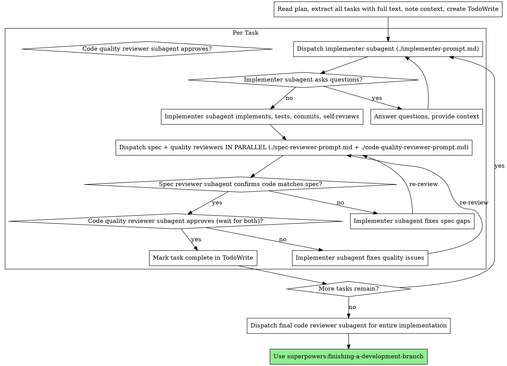

# Subagent-Driven Development

Execute plan by dispatching fresh subagent per task, with two-stage review after each: spec compliance review first, then code quality review.

**Core principle:** Fresh subagent per task + two-stage review (spec then quality) = high quality, fast iteration

## When to Use

Use this skill when all three conditions are met:
- You have an implementation plan with defined tasks
- The tasks are mostly independent (not tightly coupled)
- You want to stay in the current session (not open parallel worktrees)

Use `executing-plans` instead when you need isolated parallel sessions. Use manual execution when you don't yet have a plan or tasks are tightly coupled.

## The Process

**Parallel review note:** After each implementation task, dispatch the spec-reviewer and code-quality-reviewer in the **same turn** — both are read-only and have no dependency on each other's output. Wait for both to complete, then act on their combined findings.

**Re-review routing after fixes:**
- If spec reviewer found issues: implementer fixes them, then re-run **both** reviewers in the same turn (spec compliance may have affected quality too).
- If spec reviewer already passed and only quality issues remain: re-dispatch **only the code quality reviewer** — spec compliance was already verified and does not need to re-run.

Only mark the task complete when both spec and quality reviewers have passed in the same review round.

## Model Selection

If think-tool is available, invoke it before dispatching the implementer for each task: reason about task complexity, hidden dependencies between files, and which model tier is appropriate. This turns the narrative guidance below into an auditable per-task decision.

Use the least powerful model that can handle each role to conserve cost and increase speed.

**Mechanical implementation tasks** (isolated functions, clear specs, 1-2 files): use a fast, cheap model. Most implementation tasks are mechanical when the plan is well-specified.

**Integration and judgment tasks** (multi-file coordination, pattern matching, debugging): use a standard model.

**Architecture, design, and review tasks**: use the most capable available model.

**Task complexity signals:**
- Touches 1-2 files with a complete spec → cheap model
- Touches multiple files with integration concerns → standard model
- Requires design judgment or broad codebase understanding → most capable model

## Handling Implementer Status

Implementer subagents report one of four statuses. Handle each appropriately:

**DONE:** Proceed to spec compliance review.

**DONE_WITH_CONCERNS:** Read the concerns first — if they touch correctness or scope, address before review; if they're observations only (e.g., "file is getting large"), note and proceed to review. If think-tool is available and the concerns are ambiguous, invoke it to reason: does this touch correctness or scope, and what is the right action?

**NEEDS_CONTEXT:** Provide the missing information and re-dispatch with the same prompt + new context.

**BLOCKED:** Something must change before retrying. If think-tool is available, invoke it before deciding how to proceed — reason over: what specifically blocked the subagent, whether the plan has a gap, whether model escalation vs. task decomposition is the right remedy, and what context to add on re-dispatch. Then: provide more context and re-dispatch, escalate to a more capable model, break the task into smaller pieces, or surface to the human if the plan itself is wrong. Never retry the same model with the same inputs.

**Never** ignore an escalation or force the same model to retry without changes. If the implementer said it's stuck, something needs to change.

## Prompt Templates

- `./implementer-prompt.md` - Dispatch implementer subagent
- `./spec-reviewer-prompt.md` - Dispatch spec compliance reviewer subagent
- `./code-quality-reviewer-prompt.md` - Dispatch code quality reviewer subagent

## Example Workflow

See `references/example-workflow.md` for a full concrete trace. For context on why this approach works better than alternatives, see `references/rationale.md`.

## Red Flags

**Never:**
- Start implementation on main/master branch without explicit user consent
- Skip reviews (spec compliance OR code quality)
- Proceed with unfixed issues
- Dispatch multiple implementation subagents in parallel (conflicts)
- Make subagent read plan file (provide full text instead)
- Skip scene-setting context (subagent needs to understand where task fits)
- Ignore subagent questions (answer before letting them proceed)
- Accept "close enough" on spec compliance (spec reviewer found issues = not done)
- Skip review loops (reviewer found issues = implementer fixes = review again)
- Re-run spec reviewer when spec already passed and only quality issues remain — if spec reviewer already passed, re-dispatch only the code quality reviewer after quality fixes
- Let implementer self-review replace actual review (both are needed)
- **Act on only one review result while the other is still running** — wait for both, then decide
- Move to next task while either review has open issues

**If subagent asks questions:**
- Answer clearly and completely
- Provide additional context if needed
- Don't rush them into implementation

**If reviewer finds issues:**
- Implementer (same subagent) fixes them
- Reviewer reviews again
- Repeat until approved
- Don't skip the re-review

**If subagent fails task:**
- Dispatch fix subagent with specific instructions
- Don't try to fix manually (context pollution)

## Integration

**Required workflow skills:**
- **superpowers:using-git-worktrees** - REQUIRED: Set up isolated workspace before starting
- **superpowers:writing-plans** - Creates the plan this skill executes
- **superpowers:requesting-code-review** - Code review template for reviewer subagents
- **superpowers:finishing-a-development-branch** - Complete development after all tasks

**Subagents should use:**
- **superpowers:test-driven-development** - Subagents follow TDD for each task

**Alternative workflow:**
- **superpowers:executing-plans** - Use for parallel session instead of same-session execution
