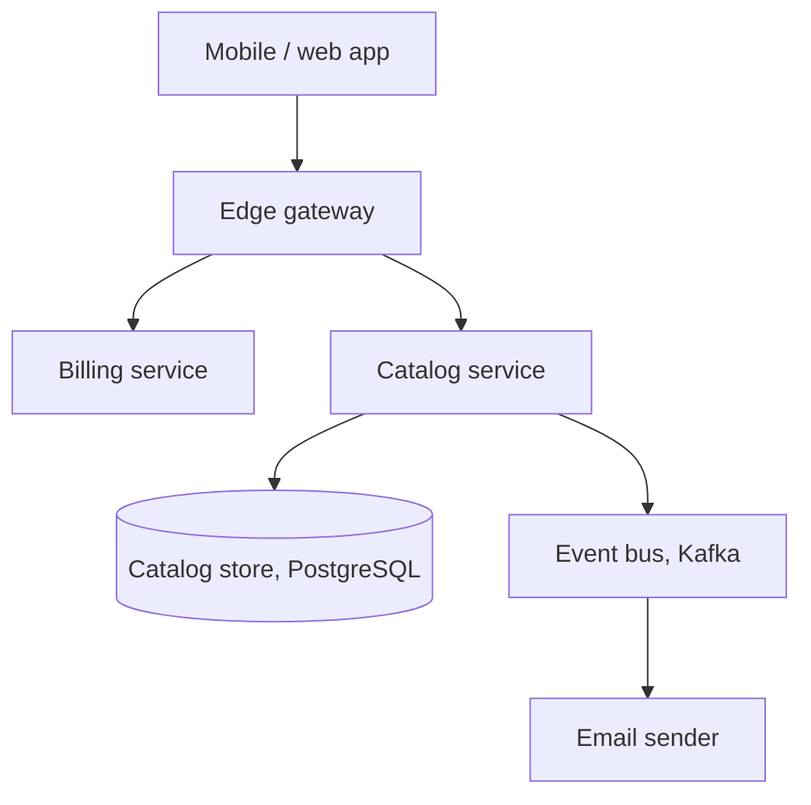

# Architecture Designer

Acts as a senior architect: shapes system topology, weighs patterns against constraints, and records the reasoning behind each choice.

## When to Use / When Not to Use

| Use | Skip |
|-----|------|
| Designing new system topology from scratch | Internal layer dependency rule (use clean-architecture) |
| Choosing between monolith, modular monolith, microservices | Domain modeling with bounded contexts (use domain-driven-design) |
| Writing ADRs for major technology choices | Coding implementation (use spring-boot-engineer, kotlin-specialist) |
| Reviewing existing architecture for scalability | |

## Process

1. **Understand requirements** — Collect what the system must do, how well it must do it, and what limits apply. Confirm nothing is missing before moving on.
2. **Identify patterns** — Map the requirements onto candidate shapes from the Reference Guide. Use think-tool to weigh trade-offs explicitly when two or more patterns plausibly fit.
3. **Design** — Draft the architecture, write down what each choice costs, and draw it. For one a person will open or share, write the diagram IR (`references/diagram-ir.md`), run `node scripts/diagram.mjs check`, apply every repair it prints, then `render` to one HTML file. You place every node - layout is part of the argument.
4. **Document** — Record every key decision as an ADR.
5. **Review** — Walk stakeholders through it. If it does not hold up, go back to step 3 with their feedback written down.

## Reference Guide

| Topic | Reference | Read when |
|-------|-----------|-----------|
| System shape | `references/architecture-patterns.md` | Deciding between monolith, modular monolith, services, events |
| ADR | `references/adr-template.md` | Recording a decision |
| Design document | `references/system-design.md` | Writing the full design up |
| Datastore | `references/database-selection.md` | Picking a database |
| Quality targets | `references/nfr-checklist.md` | Turning non-functional wishes into measurable targets |
| Diagram IR | `references/diagram-ir.md` | Drawing a system as an interactive, shareable HTML diagram |

## Constraints

**MUST DO**
- Capture each significant decision in an ADR
- State non-functional requirements up front
- Weigh costs alongside benefits
- Design for the ways it will fail
- Account for the operational burden
- Get stakeholder review before calling it final

**MUST NOT DO**
- Build for scale nobody has asked for
- Pick a technology without comparing options
- Overlook running costs
- Start designing before requirements are understood
- Leave security out
- Hand over a diagram HTML that `scripts/diagram.mjs check` has not passed

## Output Template

A design delivers:
1. Requirements recap, functional and non-functional
2. Overview diagram: Mermaid inline in a markdown doc; the IR + `diagram.mjs render` HTML (and its `.json` source) when it will be opened or shared
3. Key decisions and what they trade away (ADR format — see `references/adr-template.md`)
4. Technology picks, each with its reason
5. Risks and how to contain them

### Example diagram (Mermaid)

```mermaid
graph TD
    App["Mobile / web app"] --> Edge["Edge gateway"]
    Edge --> Billing["Billing service"]
    Edge --> Catalog["Catalog service"]
    Catalog --> Store[("Catalog store, PostgreSQL")]
    Catalog --> Bus["Event bus, Kafka"]
    Bus --> Mailer["Email sender"]
```

For a worked ADR example and full template, see `references/adr-template.md`.

## What Claude Does / What You Do

| Claude | You |
|--------|-----|
| Produces architecture diagrams (Mermaid, or a validated interactive HTML) and component descriptions | Share requirements and constraints |
| Writes ADRs with alternatives and trade-offs | Validate with domain experts and stakeholders |
| Evaluates technology options with rationale | Make final technology decisions |
| Identifies risks and mitigation strategies | Confirm operational capacity for chosen approach |

## Related Skills

- `develop:clean-architecture` — internal layer dependencies and dependency rule
- `develop:domain-driven-design` — domain modeling and bounded contexts
- `develop:microservices-architect` — distributed system decomposition
- `write:plans` (ADR format) — writing individual Architecture Decision Records
