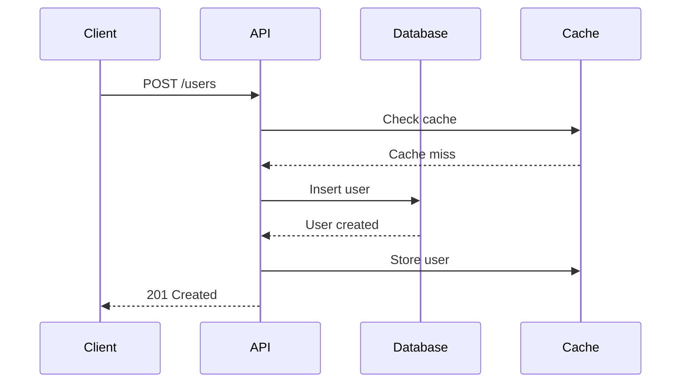
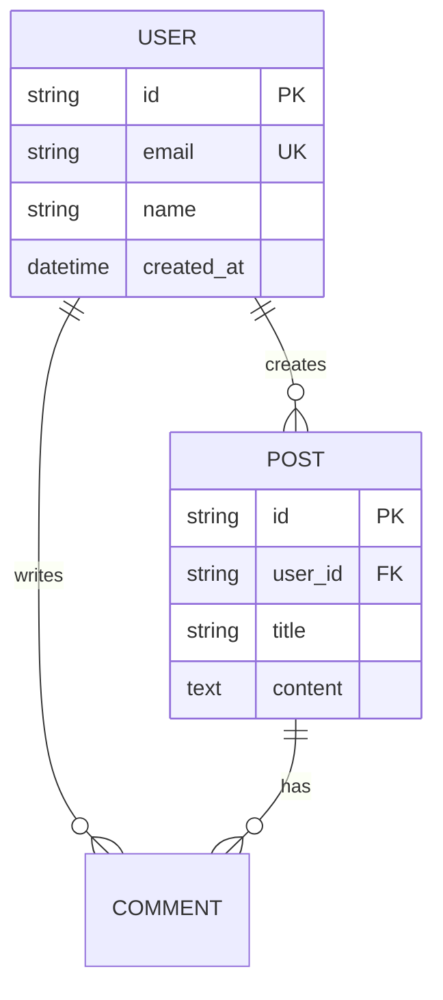

# Information Architecture & Visual Communication

## Content Hierarchy

```markdown
Documentation/
├── Getting Started/
│   ├── Quick Start (5 min)
│   ├── Installation
│   ├── Authentication
│   └── First Request
│
├── Guides/
│   ├── User Management
│   ├── File Uploads
│   ├── Webhooks
│   └── Rate Limiting
│
├── API Reference/
│   ├── Users API
│   ├── Files API
│   └── Webhooks API
│
├── SDK Documentation/
│   ├── Python SDK
│   ├── TypeScript SDK
│   └── Go SDK
│
├── Tutorials/
│   ├── Build a Dashboard (30 min)
│   ├── Integrate Authentication (45 min)
│   └── Real-time Sync (60 min)
│
└── Resources/
    ├── Troubleshooting
    ├── FAQ
    ├── Best Practices
    └── Migration Guides
```

## Writing Techniques

### Task-Based Writing

```markdown
# How to Upload a File

**Goal:** Upload an image file to your account storage

**Time:** 5 minutes

## Steps

### 1. Prepare the file
Get the file from user input or file system:
```typescript
const file = document.querySelector('input[type="file"]').files[0];
```

### 2. Create form data
```typescript
const formData = new FormData();
formData.append('file', file);
formData.append('folder', 'avatars');
```

### 3. Upload with the SDK
```typescript
const result = await client.files.upload(formData);
console.log('File URL:', result.url);
```

## Common Issues

**"File too large" error:**
Maximum file size is 10MB. Compress images before uploading.

**"Invalid file type" error:**
Only .jpg, .png, .gif are allowed. Check the file extension.

## Related
- [File API Reference](/api/files)
- [Handling Upload Progress](/guides/upload-progress)
```

### Progressive Disclosure

```markdown
# Authentication

## Basic: API Keys (Recommended for Getting Started)

API keys are the simplest way to authenticate.

```typescript
const client = new Client({ apiKey: 'your_key' });
```

**When to use:** Scripts, internal tools, testing

[Generate an API key →](/dashboard/api-keys)

<details>
<summary>Advanced: OAuth 2.0</summary>

For user-facing applications, use OAuth 2.0.

### Authorization Code Flow

1. Redirect user to authorization URL:
```typescript
const authUrl = client.oauth.getAuthUrl({
  redirectUri: 'https://yourapp.com/callback',
  scopes: ['read:users', 'write:users'],
});
window.location.href = authUrl;
```

2. Handle the callback:
```typescript
const code = new URLSearchParams(window.location.search).get('code');
const tokens = await client.oauth.exchangeCode(code);
```

3. Use the access token:
```typescript
const client = new Client({ accessToken: tokens.access_token });
```

[Full OAuth guide →](/guides/oauth)
</details>

<details>
<summary>Enterprise: JWT Tokens</summary>

For service-to-service authentication, use JWTs.

```typescript
const jwt = createJWT({
  issuer: 'your-service',
  subject: 'service-account-id',
  privateKey: process.env.PRIVATE_KEY,
});

const client = new Client({ jwt });
```

[JWT setup guide →](/guides/jwt)
</details>
```

## Visual Communication

### Diagram Integration

```markdown
# System Architecture

## Request Flow



## Data Model


```

### Screenshot Annotations

```markdown
# Dashboard Overview


**Key features:**

1. **Navigation** - Switch between sections
2. **API Key** - Copy your key (click to reveal)
3. **Usage Stats** - Current month's API calls
4. **Quick Actions** - Generate new key, view docs
5. **Recent Activity** - Last 10 API requests

## Creating Your First API Key

1. Click "Generate New Key" (highlighted in green)
2. Enter a description like "Production API"
3. Select permissions (default: all)
4. Click "Create"
5. **Important:** Copy the key immediately - it won't be shown again


```

## Writing Principles

| Writing Principle | Technique |
|------------------|-----------|
| Clarity | Active voice, short sentences |
| Scannability | Headings, lists, code blocks |
| Completeness | Prerequisites, next steps, related links |
| Accuracy | Test all code, version specifics |
