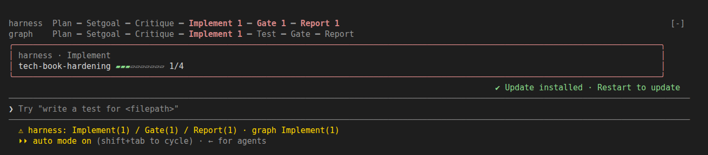
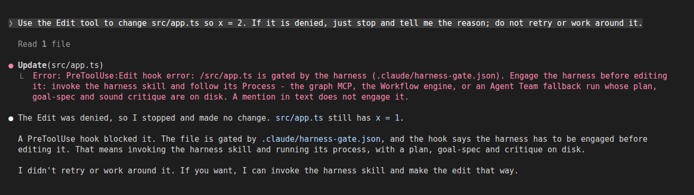
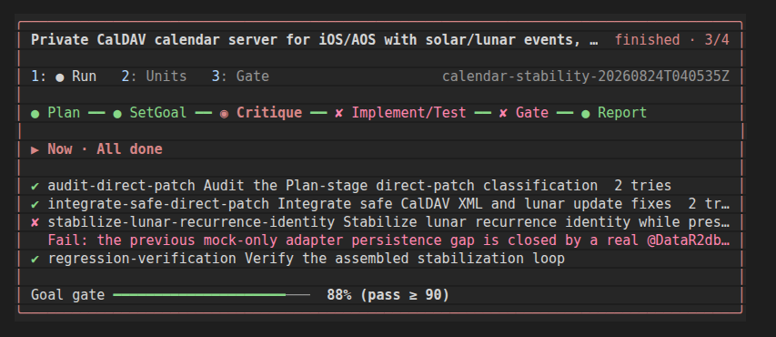
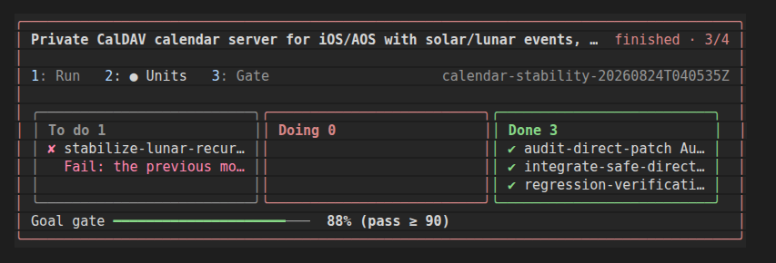
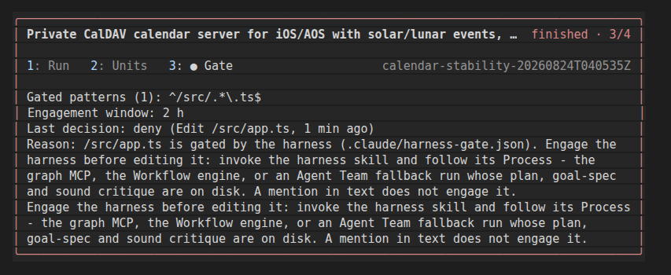

# harness

**English** · [한국어](KOR.md)

A reasoning floor for substantial requests. Not a quality maximizer — a filter that removes
**repetition** and **below-threshold answers** by forcing every request through six staged roles
with the judge separated from the actor. Planning and judging are pinned to Opus; code execution
and deterministic verification are provider-routed to the local Codex CLI when it is available.

```
Plan(opus) → SetGoal(opus) → Implement(Codex when enabled) → Test(Codex when enabled) → QualityGate(opus, loop) → Report(sonnet)
```

The plugin also ships an opt-in PreToolUse edit gate, so a project can require harness engagement
before anyone edits the paths it cares about.

## Install & Uninstall

```bash
/plugin install harness@newkayak12-claude-skills
/plugin uninstall harness@newkayak12-claude-skills
```

> **trophy rides along.** From this version, the first interactive session after you install or update this plugin installs [trophy](../trophy/README.md) (achievements) once, in user scope, if you don't have it. Nothing is sent until you say yes; uninstalling trophy is respected (it is never reinstalled). To opt out beforehand: `mkdir -p ~/.claude/plugins/.newkayak12-trophy-ride.done`. Needs `sh` (Windows without one is not covered).

Marketplace install alone enforces nothing — it makes the skills available. Run the `install`
skill inside a target project to make governance ambient (see
[Installing into a project](#installing-into-a-project)).

## Orchestration paths

| Path | When | How |
|---|---|---|
| **Graph (default)** | `graph-engineering` MCP connected | `graph:orchestrate` — the graph engine owns the flow; the main session only loops `graph_next` / `graph_run` / `graph_submit`. No transport subagents, no polling. Open with `allocation: "balanced"` for stages to actually be distributed — omit it and it falls back to legacy `ordered`, running everything in one session. |
| Workflow engine | Graph MCP absent, Workflow tool available | `Workflow({ scriptPath: "harness/engine/pipeline.js", ... })` |
| Agent team | Neither | `engine/fallback.md` |

The graph engine exists because the Workflow path had to spend a subagent per Implement/Test node
just to drive a CLI through Bash, and a subagent waiting on a process can only poll.
Measured on one real run the transport layer cost more than the reasoning layer
(6.87M vs 2.06M input tokens, zero edits by the transport). See `graph/README.md`.

## Which skill do I want?

| I want to… | Skill |
|---|---|
| Get a substantial request planned, executed, verified, and gated before it comes back | `harness` |
| Connect or verify the graph-owned default orchestration path | `graph:install` |
| Make the harness ambient in a project — gate, hook, conventions, CLAUDE.md block; optionally derive conventions from a reference project via `develop:like-my-code` | `install` |
| Take harness governance back out of a project | `remove` |
| Refresh this project's installed harness copies after a plugin version bump | `update` |
| Delegate an Implement/Test stage to the local Codex CLI from any install layout | `codex-control` |

## Skills

### `harness`

The engine entry point. Hands the raw request to `engine/pipeline.js`, which plans, authors and
critiques its own goal-spec, executes each subgoal with skill-equipped executors, verifies each
one with a separate deterministic Test agent, and gates both the subgoals and the assembled whole
before writing a report. Reach for it when the bar is "verified, not plausible". Not for trivial
edits or Q&A — the six stages cost more than the answer is worth there.

```
Run the harness on this: our order-sync job silently drops rows when the upstream page
size changes. Fix it properly and prove each part independently before reporting.
```

Invocation, mode B (the default):

```js
Workflow({ scriptPath: "harness/engine/pipeline.js", args: {
  request: "<the request>",
  context: "<optional constraints>",
  max_retries: 2,
  codex_provider: "off"      // default "off"; "auto" | "required" opt in to Codex
}})
```

Returns `report`, `all_passed`, `failed[]`, and `goal_gate` — relayed to you as-is, failures
included. Beyond the three statically mounted skills (`agents:agent-task-decomposer` at Plan,
`think:devils-advocate` at the spec critic and QualityGate,
`completion:verification-before-completion` at Test), SetGoal *may* map harness-aware repo skills
(`write:plans`, `planning:executing-plans`, `agents:subagent-driven-development`,
`develop:test-driven-development`, `write:writing-skills`, `agents:dispatching-parallel-agents`,
`think:brainstorming`) onto subgoals. All optional; a run using none of them is valid.

### `install`

Scaffolds project-owned harness governance so enforcement does not depend on the plugin staying
installed. Judgment (gate patterns, embedding choice, conventions, the CLAUDE.md block) stays with
the skill; the deterministic file work runs through `install.mjs`. Everything is idempotent and
non-destructive — existing files are reported `kept`, never overwritten. It does not run the
engine; use the `harness` skill for that.

```
이 프로젝트에 하네스 설치하고 게이트 켜줘 — Kotlin 소스만 게이트 대상으로.
```

```sh
node "<plugin>/skills/install/install.mjs" '{
  "projectDir": "<abs project root>",
  "gate": { "patterns": ["src/.*\\.kt$"], "window_hours": 2 },
  "embed": { "runtime": true, "skills": [ { "name": "...", "src": "<abs>" } ] }
}'
```

Omit `gate` to skip the gate write, `embed` to skip standalone embedding. After a plugin version
bump, re-run with `"refresh": true` — it re-copies only plugin-owned files (`goal-gate.mjs`,
`.claude/harness/**`) and never touches your gate, conventions, CLAUDE.md, or `settings.json`.

### `remove`

Uninstalls project-local harness governance: the hook, its `settings.json` registration,
`.claude/harness-gate.json`, `.claude/.harness-last-decision.json`, `.claude/harness/`,
`.claude/.harness-markers/`, the fenced CLAUDE.md block, and the `.gitignore` line. `.claude/conventions/` is project-owned and is
**preserved by default** — purging it requires explicit confirmation. A malformed `settings.json`
or unmatched CLAUDE markers are left in place and reported for manual cleanup rather than deleted
to force completion.

```
Uninstall the harness from this project, but keep .claude/conventions/ — we've edited those.
```

```sh
node "<plugin>/skills/remove/remove.mjs" '{
  "projectDir": "<abs project root>",
  "purgeConventions": false
}'
```

Idempotent: a second run reports `absent` rather than failing.

### `update`

Refreshes a project's installed harness copies after the plugin was bumped. It detects the install
mode from disk (`.claude/harness/` present → embedded), re-derives the embed config from what is
embedded, and runs `install.mjs` with `"refresh": true` — no new script. Plugin-owned copies
(`goal-gate.mjs`, `.claude/harness/**`) are reported `refreshed` or `unchanged`; your gate,
conventions, CLAUDE.md block, and `settings.json` are never touched. An embed source it cannot
resolve stops the run and is named.

```
하네스 플러그인 올렸는데 이 프로젝트 복사본도 최신으로 맞춰줘.
```

Maintainers cutting a patch release of this source use `node _repo/scripts/patch-harness.mjs`
(see the repo CLAUDE.md Update Workflow); it is not a user skill.

### `codex-control`

The adapter-discovery contract used by Codex-enabled Implement/Test stages, so delegation works
without assuming the project embedded `.claude/harness/**`. It resolves the first existing
`codex-exec-adapter.mjs`, and when none exists it records Codex as unavailable and lets the stage
continue on the normal Claude path.

```
Harness Implement stage needs to run Codex from plugin mode — resolve the adapter first.
```

Resolution order:

| # | Layout | Path |
|---|---|---|
| 1 | Explicit arg | `args.codex_adapter_path` |
| 2 | Repo-local | `harness/engine/codex-exec-adapter.mjs` |
| 3 | Embedded install | `.claude/harness/engine/codex-exec-adapter.mjs` |
| 4 | Plugin mode | derived from the `scriptPath` in the project's CLAUDE.md Harness block |

Run contract: always `--detect` before delegating; separate Codex processes for Implement and
Test; Implement may use `--sandbox workspace-write`; Test prompts are verification-only and must
never edit implementation files or trust the Implement narrative without command/file evidence.

## How it works

1. **You pass a raw request.** `Workflow({ scriptPath: "harness/engine/pipeline.js", args: { request: "..." } })`
2. **The engine plans and authors the goal-spec itself** (Opus, with an adversarial critic
   pass), so spec quality doesn't depend on the main-session model. Schema: [`goal-spec.md`](goal-spec.md).
3. **Each subgoal loops Implement → Test → QualityGate** (bounded by `max_retries`):
   executors invoke this repo's skills; a separate Test agent produces deterministic
   evidence (runs commands, reads artifacts); a separate Opus judge gates on evidence.
4. **A goal-level gate scores the assembled whole against the goal** (0-100 `match_pct`,
   pass requires >= 90%; below threshold triggers a repair pass and re-gate), then a
   Report stage synthesizes.

With `codex_provider: "auto"` or `"required"`, Codex is the **default** route for every
Implement/Test stage: a minimal Sonnet controller resolves the adapter via `codex-control`, runs a
separate local `codex exec --json` process, and converts its output into the normal `HANDOFF` or
evidence JSON — it must not redo the work itself on success. `auto` may explicitly degrade to
Sonnet on route failure; `required` reports provider failure instead. `off` forces plain Sonnet.
`implement_provider` / `test_provider` in the goal-spec are trace hints, not prerequisites.

## Modes

- **B (default):** raw request + the fixed engine.
- **DW-off fallback:** when Dynamic Workflow is disabled or the Workflow tool is absent, form a
  role-isolated Agent Team and run the same six roles through the file-backed fallback contract
  ([`engine/fallback.md`](engine/fallback.md)). The team lead only coordinates; Implement, Test,
  and QualityGate remain separate teammates exchanging file paths through a run directory, and
  [`engine/fallback-check.mjs`](engine/fallback-check.mjs) is the objective done-signal.
- **M (meta):** the harness *generates* a bespoke Workflow when the request needs control
  flow the fixed stages can't express (tournament, escalation, loop-until-dry) — it copies
  [`templates/meta-skeleton.js`](templates/meta-skeleton.js), rewrites only the `[META]`
  Work block, and runs it. The skeleton's contract (judge ≠ actor, provider routing,
  bounded loops, deterministic Test, goal-level gate) stays verbatim.
- **A (manual):** you author the bespoke Workflow yourself — see [`templates/`](templates/).

When the active orchestrator is Codex itself, do not recurse through `codex`,
`codex-exec-adapter.mjs`, or `codex-runner.mjs` — run the six-stage contract directly with native
Codex tools per the repository `AGENTS.md`.

## Installing into a project

Marketplace install alone enforces nothing. Run the **`install` skill**
([`skills/install/SKILL.md`](skills/install/SKILL.md)) from the target project to make
governance ambient — it scaffolds project-owned copies (never overwrites existing files):

- `.claude/harness-gate.json` — activates the edit gate on confirmed path patterns
- `.claude/hooks/goal-gate.mjs` + a merged `.claude/settings.json` PreToolUse entry —
  the self-contained gate hook, committed so it enforces team-wide without depending on
  the plugin install (engine still lives in the plugin — see the install skill's gap note)
- `.claude/conventions/{coding,verification,boundaries}.md` — default ruleset the engine
  reads (SetGoal → acceptance/test, Implement → follows)
  If you have a reference project, install can fill `coding.md`/`boundaries.md` from it via `develop:like-my-code` (skipped when develop is absent)
- a fenced `## Harness` section appended to the project's `CLAUDE.md`
- `.claude/.harness-markers/` in `.gitignore`

The project owns the copies afterward. Lifecycle skills only change them when explicitly
invoked: `install` with `refresh:true` refreshes plugin-owned copies, and `remove` cleans up
the installation.

**Enforcement** is an opt-in PreToolUse gate ([`hooks/`](hooks/)): a project lists gated paths in
`.claude/harness-gate.json`, and `Write|Edit|MultiEdit|NotebookEdit` there — or a `Bash` command
that writes there — requires harness engagement. Engagement is a record (a Workflow/graph/teams
tool call that ran, an open broker node, or a fallback run with plan, goal-spec and a sound
critique on disk), never a string in the transcript. The gate's own config, hook and settings
are always gated. Fail-open everywhere (v0 lesson).

## Lifecycle helpers

- **`harness:remove`** removes the installed hook, registration, gate, embedded runtime,
  marker cache, CLAUDE.md block, and gitignore entry. Project-owned conventions are preserved
  unless their removal is explicitly requested.
- **`harness:update`** refreshes a project's installed copies after a plugin bump by running
  `install.mjs` with `"refresh": true`; user-owned files are never touched.

## Mod (Claude Code live UI)

harness ships a small mod: a status line and a pipeline band above the prompt with the open runs per stage, and a pane with the run, its units and the gate. It is early access and optional. The gate itself is the command hook and works without it, and the mod does not change how it decides.

**Version.** Modules load on Claude Code 2.1.292 and newer. The module API is early access and may change between releases. An older build skips the module: 2.1.284 was checked, it prints one stderr line (`hooks module not loaded: …`) and the command hooks, MCP and CLIs work unchanged. If a build says modules are not turned on for installed plugins, set `CLAUDE_CODE_ENABLE_FUNCTION_HOOKS=1`.

| Where it runs | Mod |
|---|---|
| Interactive terminal | on |
| Desktop app, Code tab | on |
| `claude -p` and headless adapters | off (no UI surface) |
| Codex, or no plugin | not applicable, nothing is lost |

**Features**

- **Status line**: open runs per stage in this worktree (other worktrees belong to other sessions), fallback runs first, then graph runs — `Plan(6) / Implement(11) · graph Implement(3)`. A run untouched for 12 h is left out; with nothing open the line is empty. Gate decisions are not shown here; open `/harness-gate`.
- **Band** above the prompt: one pipeline row per kind with open runs (`harness`, then `graph`), `Plan ━ Setgoal ━ Critique ━ Implement ━ Test ━ Gate ━ Report` (Test for harness only). A stage with open runs is a bold chip with its count (`Implement 11`), empty stages are dim; labels shorten to fit 80 columns. Hover a chip for a card listing its runs: slug, a ▰▱ passed/total bar and `N failed`. Hidden when nothing is open.
- **`/harness-gate`** opens the pane on the Gate tab. The tabs are Run, Units and Gate (keys `1`-`3`; the selected one is bright with a dot).
  - **Run** draws the six stages as a rail (`● Plan ━━ ● SetGoal ━━ ● Critique ━━ ◉ Implement/Test ┄┄ ○ Gate ┄┄ ○ Report`: solid up to where the run is, dotted after), what it is doing now, one line per subgoal and a progress bar.
  - **Units** is a board with To do, Doing and Done columns for the subgoals, with tries and the goal-gate match as a `%` bar against the pass bar.
  - **Gate** is the existing view: the gated patterns, the engagement window, the last decision (allow or deny, tool, target, age, reason) and how to engage the harness. Without a gate config it says so.
- **Where the data comes from.** The run view reads `.harness-run/<run>/` in the session folder (plan, goal spec, critique, gate files and the subgoal folders) read-only, and follows the newest live run, else the newest run. The last decision comes from `.claude/.harness-last-decision.json`, written by the gate hook. It is a local runtime file, gitignored by `install`, and removed by `remove`. A gate config that cannot be read shows an invalid-config notice on the Gate tab.
- **Language.** English by default; Korean when Claude Code's `language` setting is Korean.

Known limitations: the status reads the gate config relative to the session's working directory. A session that started with no UI surface (headless or SDK-hosted) keeps the mod off even if a client attaches later; start a new session to get it (a reload of an unchanged mod does not re-fire session.start).

### Screenshots

Captured from a live Claude Code 2.1.293 terminal session.


The band with open harness and graph runs, the hover card of the `Implement 1` chip, and the status line under the prompt.


The gate hook denying an Edit to a gated path before the harness is engaged.


`/harness-gate`, Run tab: stage rail, what the run is doing, one line per subgoal, goal-gate bar.


`/harness-gate`, Units tab: To do / Doing / Done board of the subgoals.


`/harness-gate`, Gate tab: gated patterns, engagement window and the last decision.

## Status
- v1.27.0 — install asks whether a reference project exists (default No); if yes, `develop:like-my-code` fills `.claude/conventions/coding.md` and `boundaries.md` from its style, each rule with repo evidence and a cited source; skipped when develop is absent
- v1.26.2 — trophy rides along: the first interactive session after this update installs trophy once if missing (uninstall respected)
- v1.26.1 — Mod: the band and status line count only this worktree's runs (other worktrees belong to other sessions)
- v1.26.0 — Mod: the `/harness-gate` pane becomes a run view in the teams 0.46.0 style: tabs Run / Units / Gate (keys `1`-`3`), a six-stage rail, per-unit state, a goal-gate match bar and what runs now; `/harness-gate` opens on Gate (gate info unchanged, plus a line for an unreadable gate config). The 1.25.0 status line and pipeline band are kept. English by default, Korean with Claude Code's `language`. Mod tests 38; real Claude Code captures EN/KO
- v1.25.1 — Mod: the band hover card opens in the flow under the stage rows (an absolute card above the band was clipped; checked live); graph runs are named by their request
- v1.25.0 — Mod: status line counts open runs per stage (fallback + graph, every worktree: `Plan(6) / Implement(11) · graph Implement(3)`); pipeline band above the prompt with stage chips and a hover card of per-run progress; Ink-style `/harness-gate` pane. Gate decisions now live only in the pane
- v1.24.0 — Mod (Claude Code 2.1.292+, early access): gate status line and `/harness-gate` pane; the goal gate records its last decision to `.claude/.harness-last-decision.json` (install/remove manage the file) and resolves write targets through indirection
- v1.23.0 — `harness:patch` leaves the user surface (maintainer script moved to `_repo/scripts/patch-harness.mjs`); new `harness:update` refreshes installed copies via `install.mjs` `"refresh": true`
- v1.22.8 — codex-control gains a Related Skills section and Korean scenarios (repo audit)
- v1.22.7 — repo scripts moved under `_repo/`; the patch skill runs `_repo/scripts/validate_plugins.py`
- v1.22.6 — harness-aware skill write:writing-plans renamed write:plans
- v1.22.5 — All five skills now carry a standard What Claude Does / What You Do table.
- v1.22.4 — goal gate Bash judgement is deny by default without false positives: a write verb is exempt only as a plain argument of a read-only command that owns the whole simple command (`grep -n cp x.mjs`; not `rg --pre`, `less -o`, `$(…)`); wrappers and an interpreter/shell anywhere in a command are judged; `git --output` counts; an inline or heredoc script counts named paths only when it can write, a heredoc used as data only its redirect (unless its body writes, or its file is code or run later); heredocs are found outside quotes and an unclosed one is judged whole; the broker ledger `.harness-run/broker/` is gated
- v1.22.3 — goal gate engages only on records (a tool call that ran, a broker node, a fallback run with a sound critique) - never transcript text; root from the target file (subdirs, sibling worktrees); gates its own config/hook/settings; judges Bash writes; ignores future timestamps; install widens old matchers and ignores .harness-run/
- **v1.22.2 — graph path opens in balanced mode**: step 0 documented `graph_open({request,
  cwd, vendor, isolated})`, omitting `allocation`. The broker defaults it to `"ordered"`,
  where `vendor: "auto"` stays on `self` — so a caller following this signature silently ran
  every stage in one session instead of distributing them. The call now names
  `allocation: "balanced"`, `host_vendor` and `host_model`.
- **v1.22.1 — stable line. Claude-only by default**: `codex_provider` now defaults to
  `"off"` in `pipeline.js`, the Agent Team fallback skips provider detection unless a run
  opts in, and the graph's `vendor: "auto"` resolves to `self` instead of probing Codex. No
  external provider is contacted unless a caller names one. Codex delegation is fully
  preserved and reachable by opting in (`codex_provider: "auto"｜"required"`, or
  `vendor: "codex"`). Primary path DW/Workflow, secondary Agent Team; the six stages, model
  pins, retry bounds, and the goal-level gate are unchanged.
- v1.22.0 — **Graph plugin separation**: the graph-engineering MCP moved from the
  short-lived `broker` namespace to the independently versioned `graph` plugin. Harness now
  discovers `graph-engineering` and delegates its default loop to `graph:orchestrate`; setup
  and connection verification live in `graph:install`. The Workflow and Agent Team paths
  remain fallbacks.
- v1.20.0 — **Lifecycle helpers**: added `harness:remove` for deterministic, idempotent
  project cleanup with user-owned conventions preserved by default, and `harness:patch` for
  synchronized patch-version bumps across both manifests plus the README Status entry. Fixture
  tests cover mixed-setting preservation, malformed-file safety, idempotence, dry-run, and
  mismatch refusal.
- v1.19.0 — **DW-off Agent Team fallback**: when Dynamic Workflow is disabled or the Workflow
  tool is absent, the fallback now explicitly requires a role-isolated Agent Team. A thin team
  lead declares Plan, SetGoal/Critic, Implement, Test, QualityGate, and Report ownership in the
  run manifest; teammates exchange only file paths through the run directory, and actor/judge
  separation remains mandatory. Native team primitives are preferred, with an explicit logical
  team of role-separated agents as the portable equivalent. `pipeline.js` is unchanged.
- v1.18.0 — **Codex-first Implement/Test routing**: `codex_provider: "auto"` / `"required"`
  now routes every Workflow Implement/Test stage through the Codex controller by default.
  `implement_provider: "codex"` and `test_provider: "codex"` remain optional trace hints in the
  goal-spec, but missing fields no longer keep a subgoal on Sonnet. This makes the graph shape
  explicit: Claude plans, sets goals, judges, and reports; Codex owns leaf implementation and
  deterministic verification whenever the local CLI route is available. Fallback mode documents
  the same default-provider rule when `RUN/providers.json` says Codex is ready.
- v1.17.0 — **Workflow Codex provider routing semantics**: `implement_provider: "codex"` and
  `test_provider: "codex"` now mean runtime delegation, not trace hints. The Workflow path still
  uses a tiny Sonnet controller because Workflow scripts cannot spawn providers directly, but that
  controller only resolves the adapter, invokes Codex, and converts Codex output into the normal
  handoff/evidence shape. On Codex success it must not redo implementation or verification with
  Sonnet. `codex_provider: "auto"` allows an explicit degraded Sonnet fallback; required mode
  reports provider failure instead of silently falling back. Goal-level repairs also
  prefer the Codex route when delegation is enabled.
- v1.16.2 — **Codex session compatibility boundary**: added `AGENTS.md` guidance that an
  active Codex session must run the harness contract directly with native Codex tools, not
  recurse through `codex`, `codex-exec-adapter.mjs`, or `codex-runner.mjs`. The Codex CLI
  adapter remains only for Claude-orchestrated Workflow/fallback delegation and external
  automation. The Claude Workflow path (`engine/pipeline.js`) is unchanged.
- v1.16.1 — **Codex plugin-mode adapter discovery**: added `harness:codex-control` and
  mounted it in Workflow Implement/Test Codex delegation. `pipeline.js` now honors an explicit
  `args.codex_adapter_path` before repo-local and embedded paths, then uses the skill's
  plugin-mode fallback to derive the adapter beside the plugin-root `pipeline.js` referenced
  from the project's Harness block. The install template now includes `codex_adapter_path` in
  the plugin-mode Workflow example, so non-embedded projects can use Codex without symlinks or
  copying `.claude/harness/**`.
- v1.16.0 — **Workflow Implement/Test Codex delegation**: when `codex_provider` is not off,
  the fixed `pipeline.js` path now has both Sonnet Implement and Sonnet Test agents try the
  local Codex CLI bridge at the start of their stages. Implement uses Codex for code/repo work
  before emitting the normal `HANDOFF`; Test uses a separate Codex call for verification-only
  evidence before producing the normal evidence JSON. Both stages fall back to direct Sonnet
  work if the adapter or Codex CLI is unavailable or returns non-zero.
- v1.15.0 — **Workflow Implement Codex bridge**: the fixed `pipeline.js` path can now keep
  Implement as a Sonnet stage while letting that Sonnet agent call the local Codex CLI through
  `engine/codex-exec-adapter.mjs`. SetGoal may mark code-oriented subgoals with
  `implement_provider: "codex"` when `codex_provider` is not off; the Implement agent runs
  detection, invokes `codex exec --json`, reads the result, and emits the normal `HANDOFF`.
  If Codex is unavailable or fails, the same Sonnet agent falls back to direct implementation.
- v1.14.0 — **Codex solo runner**: added `engine/codex-runner.mjs`, a Codex-only harness
  entrypoint that reproduces the file-artifact fallback contract without touching the Claude
  Workflow path. It runs Plan, SetGoal, Implement, Test, QualityGate, and Report as separate
  `codex exec --json` stages, writes the same `.harness-run/<slug>/` artifacts checked by
  `fallback-check.mjs`, and keeps `pipeline.js` unchanged. Added root `AGENTS.md` so Codex can
  work in this repo without relying on `CLAUDE.md`.
- v1.13.0 — **fallback Codex CLI provider spike promoted**: Workflow-less fallback runs now
  have a documented CLI straight-control path for Codex. At run open, the fallback may call
  `engine/codex-exec-adapter.mjs --detect` to write provider readiness; SetGoal can then mark
  code-oriented subgoals with `implement_provider: "codex"` / `test_provider: "codex"`.
  Implement and Test stay separate `codex exec --json` processes, with JSONL event artifacts
  plus final summary JSON, and Claude still owns Plan, SetGoal, QualityGate, and Report.
  `pipeline.js` remained Claude Workflow-native in this release; v1.15.0 adds a Sonnet-driven
  CLI bridge for Implement, still not a native Workflow provider abstraction.
- v1.12.1 — **Plan skill-namespace hint fix**: the Plan stage's `skills fit (plugins: …)` hint
  in `engine/pipeline.js` now includes `planning:*` and `completion:*`, so the optional executor
  the docs recommend (`planning:executing-plans`) and the statically-mounted
  `completion:verification-before-completion` are actually surfaced to the SetGoal author. Prompt
  hint only — no control-flow change. (Design notes for an upcoming SetGoal review-checkpoint +
  per-subgoal parallel authoring live in `_draft/graph-engineering/`.)
- v1.12.0 — **loop-convergence hardening** (all three execution paths: `pipeline.js`,
  `templates/meta-skeleton.js`, `engine/fallback.md`). SetGoal authoring + the spec critic now
  reject two unwinnable-gate patterns that could burn the whole retry budget without ever passing:
  (1) acceptance/test criteria keyed to **global/shared repo state** (whole-repo `git diff/status`,
  aggregate counts) instead of the subgoal's own artifacts — concurrent work makes those
  non-deterministic; (2) **aspirational / arbitrary-threshold** targets (a chosen % reduction,
  subjective quality words) written as hard pass/fail bars. And both the per-subgoal and goal-level
  QualityGate loops gain a **no-progress early stop**: if a repair attempt reproduces the previous
  attempt's exact gaps/reason, the loop breaks early instead of spending the rest of its
  `max_retries` on an identical gap (still hard-capped by `max_retries` — only exits sooner).
- v1.11.1 — documented the **optional** harness-aware skill integrations: SetGoal may map the
  repo's dual-mode cluster-B skills (`plans`, `executing-plans`, `subagent-driven-development`,
  `test-driven-development`, `writing-skills`, `dispatching-parallel-agents`, `brainstorming`) as
  subgoal executors when the task fits — none required, each also runs standalone. See the harness
  skill's "Optional skill integrations".
- v1.11.0 — **re-introduced** the Workflow-less fallback ([`engine/fallback.md`](engine/fallback.md)),
  redesigned to fix what sank v1.9.0. No transcript sentinel and no edit-gate coupling (those
  false-positived on quoted occurrences). Instead: the six stages run as **fresh per-stage Agent
  subagents** that exchange work through files in a **run directory**, so the orchestrator stays a
  thin dispatcher and a long run can't pollute its context; completion is an **objective, resumable
  check** ([`engine/fallback-check.mjs`](engine/fallback-check.mjs)) that names any missing or
  degenerate stage artifact. Selected only when the Workflow tool is absent; `pipeline.js` (Workflow
  path) unchanged. Honest ceiling: still fail-open — the check makes a skipped stage detectable,
  not impossible.
- v1.10.0 — removed the original Workflow-less fallback: its sentinel was a plain documented string
  that leaked into transcripts and false-positived Workflow-capable sessions.
- v1.9.0 — (superseded) first Workflow-less fallback attempt via the Agent tool + a sentinel gate.
- v1.8.0 — `install.mjs` gains a `refresh: true` mode: after a plugin version bump it
  re-copies only the plugin-owned files (`goal-gate.mjs`, embedded `.claude/harness/**`),
  reporting `refreshed`/`unchanged`, and never touches user-owned files (gate, conventions,
  CLAUDE.md, settings.json). Default stays non-destructive. Corrects the earlier inaccurate
  "re-run to refresh" note (a plain re-run keeps everything).
- v1.7.0 — Planner now mounts `agents:agent-task-decomposer` with a systems-analyst persona
  (crisp, dependency-mapped, independently-verifiable units); Report gains an honest
  status-reporter persona (sonnet unchanged). Standalone embedding's static-skill set updated
  to three (decomposer + devils-advocate + verification-before-completion).
- v1.6.0 — `install` delegates its deterministic file work (gate write, hook copy +
  `.claude/settings.json` merge, standalone embedding, `.gitignore`) to
  [`skills/install/install.mjs`](skills/install/install.mjs); the skill keeps only
  judgment/dialogue. Idempotent JSON merge (never clobbers existing hooks, leaves
  unparseable settings untouched). Skill descriptions front-loaded for trigger matching.
- v1.5.0 — `install` now embeds the gate hook into the project: copies the self-contained
  `goal-gate.mjs` to `.claude/hooks/` and merges a PreToolUse entry into committed
  `.claude/settings.json`, so enforcement is project-owned (no plugin dependency for the
  gate). Idempotent merge. It also **asks whether to embed the engine + statically-referenced
  skills into `.claude/harness/`** for plugin-less environments (air-gapped/CI) — opt-in,
  with the dynamic-`skills[]` boundary called out (SetGoal picks those from the whole
  catalogue and they can't be pre-enumerated).
- v1.4.0 — Mode M: the harness generates request-shaped bespoke Workflows from
  `templates/meta-skeleton.js` (contract-preserving meta-scripts).
- v1.2.0 — `install` skill: per-project scaffolding (gate + conventions + CLAUDE.md section).
- v1.1.0 — six-stage engine; restores separate Plan/SetGoal/Test stages, spec critic,
  goal-level gate, and structured handoffs on top of the v1.0.0 lightweight rebuild
  (v0 preserved in git history at tag `harness-v0`; its situational rulesets were
  recycled into the install skill's optional conventions).
- Enforcement: **opt-in PreToolUse gate** ([`hooks/`](hooks/)) — a project lists gated
  paths in `.claude/harness-gate.json`; edits there require harness engagement.
  Fail-open everywhere (v0 lesson); a nudge, not security.

Entry points: [`harness`](skills/harness/SKILL.md),
[`install`](skills/install/SKILL.md), [`remove`](skills/remove/SKILL.md),
[`update`](skills/update/SKILL.md), and [`codex-control`](skills/codex-control/SKILL.md).

---
