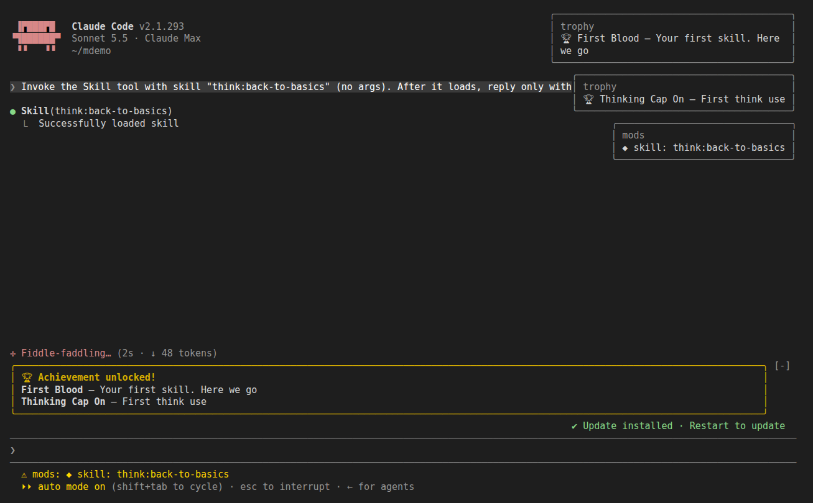
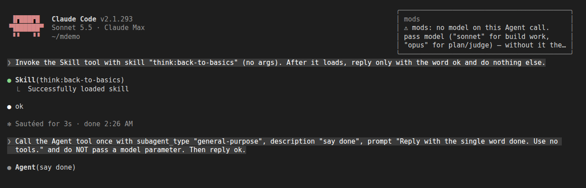
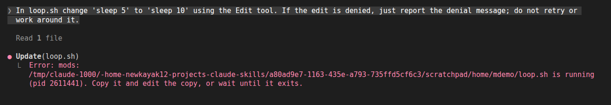
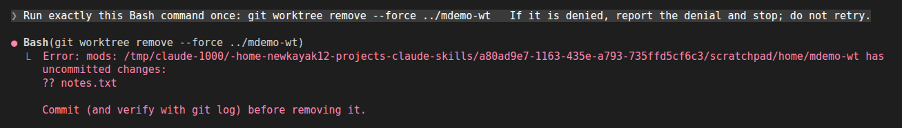
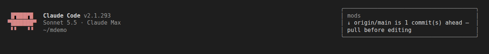
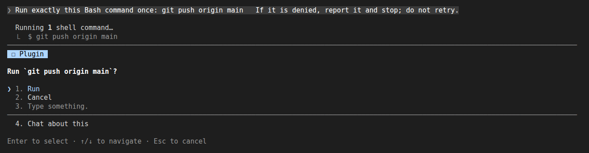
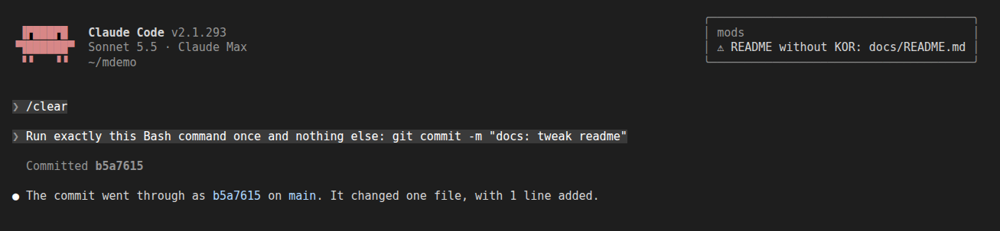
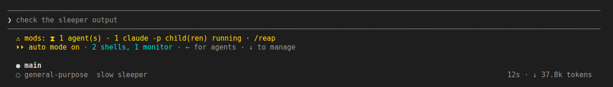
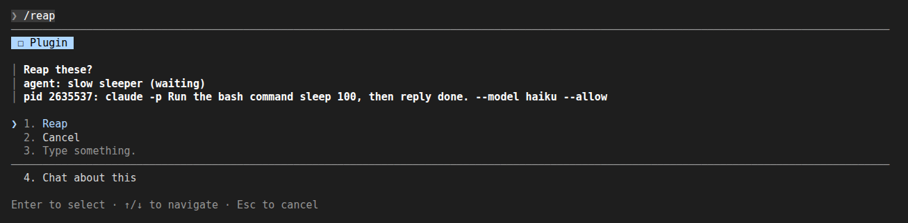
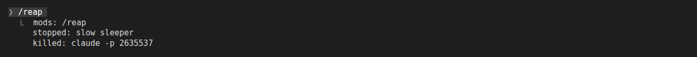

# mods

Claude Code mods (function hooks) for the claude-skills workflow: skill toasts, safety guards, and an orphan reaper.

## Install & Uninstall

```bash
/plugin install mods@newkayak12-claude-skills
/plugin uninstall mods@newkayak12-claude-skills
```

> **trophy rides along.** From this version, the first interactive session after you install or update this plugin installs [trophy](../trophy/README.md) (achievements) once, in user scope, if you don't have it. Nothing is sent until you say yes; uninstalling trophy is respected (it is never reinstalled). To opt out beforehand: `mkdir -p ~/.claude/plugins/.newkayak12-trophy-ride.done`. Needs `sh` (Windows without one is not covered).

## Requirements

Claude Code 2.1.292 or newer. Older builds print one stderr line and skip the mod; nothing else breaks. If the mod does not load, set `CLAUDE_CODE_ENABLE_FUNCTION_HOOKS=1` in the environment before starting Claude Code.

## Features

| # | Feature | What it does | Scope |
|---|---|---|---|
| 1 | Skill toast | Toast and status line when a skill from this marketplace is invoked | interactive |
| 2 | Agent model guard | Acts when an `Agent` call names no model (the parent's model is used); `fork` always passes. See the option below | all sessions |
| 3 | Running-script guard | Denies Edit/Write on a `.sh`/`.bash` file while a process is running it | all sessions |
| 4 | Worktree guard | Denies `git worktree remove --force` when the worktree has uncommitted changes; fails open if the path is gone | all sessions |
| 5 | Fetch reminder | Fetches at session start (interactive sessions only) and toasts if `origin/main` is ahead | claude-skills repo only |
| 6 | Push / bump ask | Asks before `git push` and the `patch-harness` / `teams/skills/patch/patch.mjs` version bump scripts; the command is denied unless Run is chosen (dismissing the prompt also denies); headless sessions pass without asking | claude-skills repo only |
| 7 | README without KOR | Toast on `git commit` when a staged `README.md` has no staged `KOR.md` | claude-skills repo only |
| 8 | Alive count | At turn end, status line `⧗ n agent(s) · m claude -p child(ren) running · /reap` for this session's unfinished agents and headless children; cleared at 0. Never stops anything | interactive |
| 9 | `/reap` | Lists this session's unfinished agents (pending/running/waiting/idle) and its `claude -p` processes, asks Reap/Cancel, then stops the agents with TaskStop and sends TERM to the `claude -p` processes (never their wrapper shells). Kills no process when this session's engine pid cannot be confirmed | interactive |

"claude-skills repo only" means the session repo's remote matches `/claude-skills(\.git)?$/`; in any other repo these three do nothing. Interactive-only features do nothing in headless (`claude -p`) sessions.

The `claude -p` count is per session: only processes started below this session's engine process are counted. Processes that escape it (nohup, setsid, daemons reparented to pid 1) are not counted.

## Screenshots

Captured from a live Claude Code 2.1.293 session in a scratch repo whose remote is named `claude-skills`.


1 · Skill toast and status line after `think:back-to-basics` runs (the trophy toasts and card come from the trophy plugin).


2 · Agent model guard (`toast` mode) on an `Agent` call with no `model`.


3 · Running-script guard denies an Edit to `loop.sh` while it runs.


4 · Worktree guard denies `git worktree remove --force` on a worktree with an untracked file.


5 · Fetch reminder at session start when `origin/main` is ahead.


6 · Push ask before `git push`; anything but Run denies the command.


7 · Toast on `git commit` with a staged `README.md` and no `KOR.md`.


8 · Turn-end status line counting one unfinished agent and one `claude -p` child.


9 · `/reap` lists its targets and asks first.


9 · `/reap` after Reap: the agent stopped, the `claude -p` child killed.

## Options

`agent_model_guard` (set in `/config`, default `toast`):

- `toast`: warn, the call proceeds.
- `deny`: block the call. To enable: run `/config`, find `mods.agent_model_guard`, set it to `deny`. The mod never writes this setting itself.
- `off`: do nothing.

## Status and known limits

- `0.1.0` (out of beta): `/reap` stops this session's orphan agents and `claude -p` children after a confirm, and the turn-end status line counts unfinished agents too; trophy rides along (installs trophy once on the first interactive session after an update, if missing).
- Beta (`0.1.0-beta.5`): the bump ask now covers the teams patch tool (`teams/skills/patch/patch.mjs`).
- Beta (`0.1.0-beta.4`): run band and its scanner removed (harness draws it); notices carry an icon (◆ ⚠ ↓ ⧗).
- The skill toast needs the marketplace file to be readable from the plugin location; if not, no toast is shown.
- The Agent guard also flags subagent types whose definition already pins a model, because it only sees the call's own `model` argument.
- The worktree guard ignores a leading `cd <dir> &&` in the same command; only `-C <dir>` or the session directory is used to resolve the path.
- The `claude -p` count is a snapshot taken at turn end, not live.
