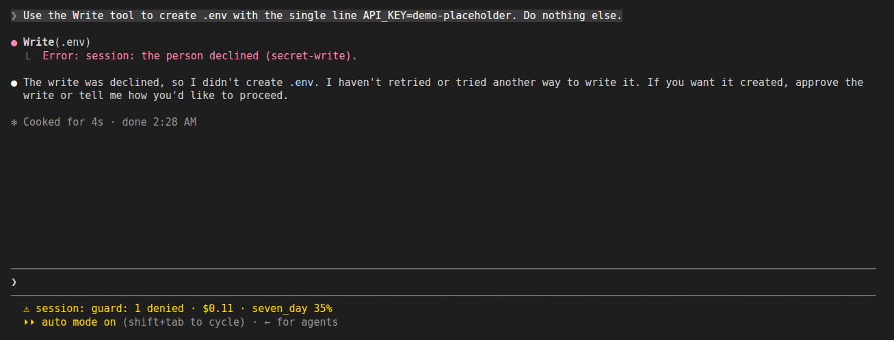
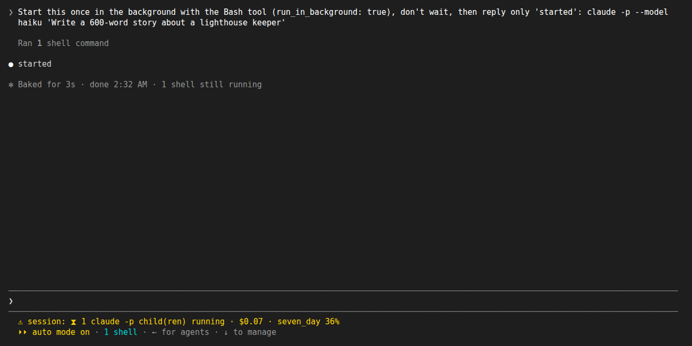
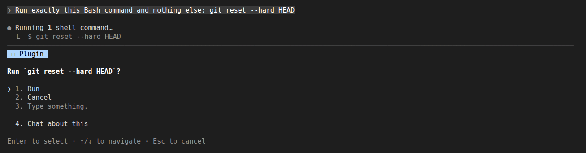
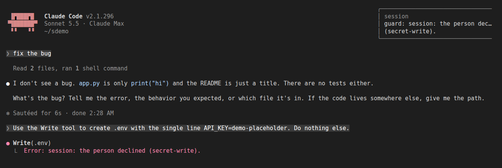
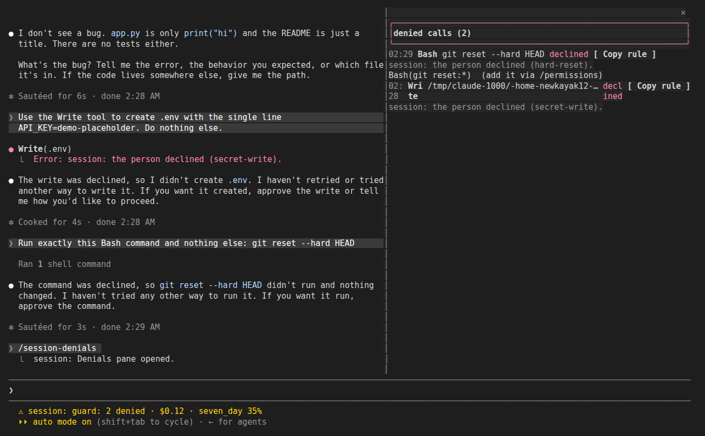
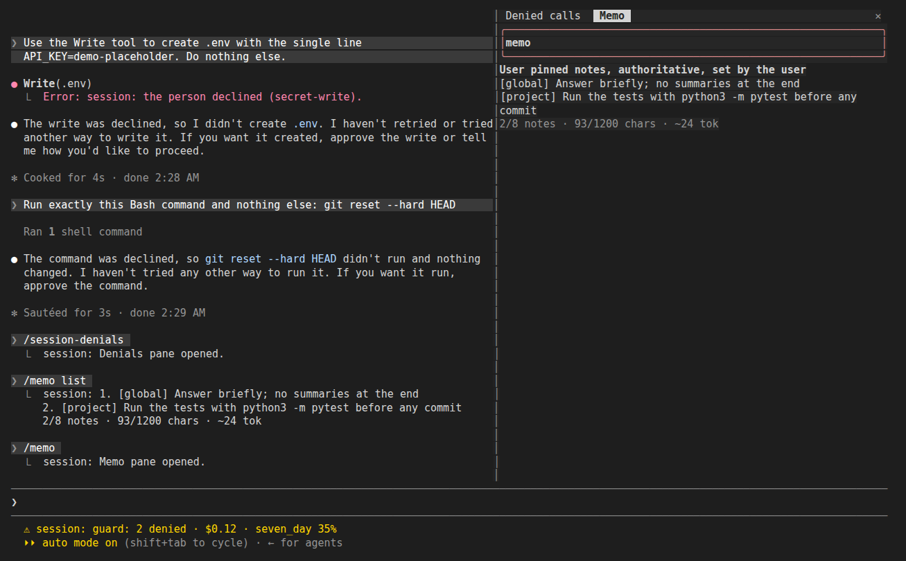
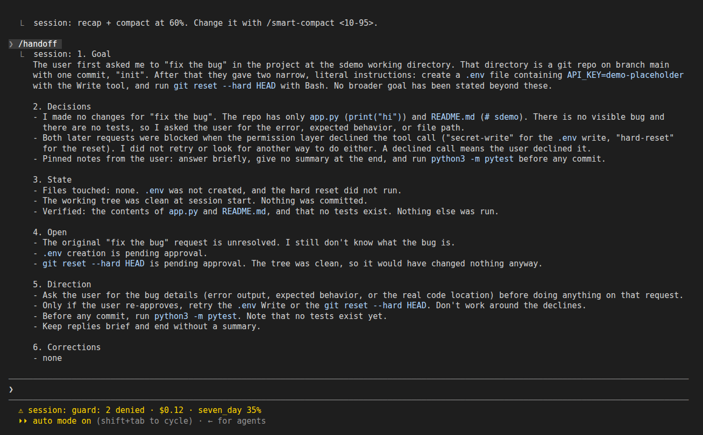
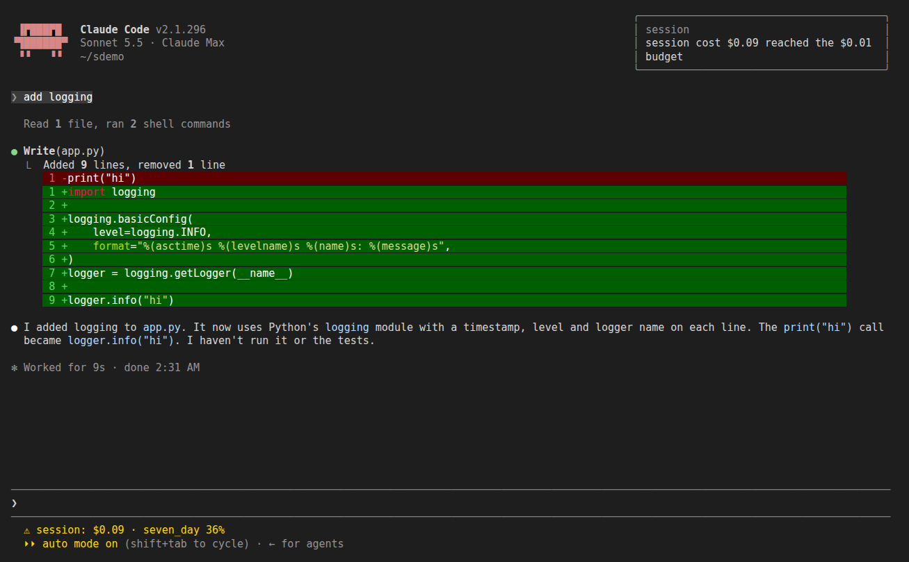
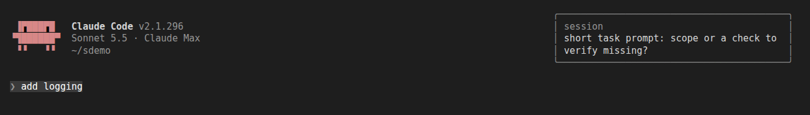

# session

Shows what a Claude Code session left behind (files changed, commits, denied calls, longest gap between tool calls), shows it again as a band on your next start, lists stray `claude -p` children and stops one safely, guards dangerous commands and secret writes, keeps `/memo` notes, recaps before compacting at a % you set, keeps that recap for `/handoff`, `/recap` and `/lessons`, times tasks and shows the cost, shows every open session on one `/board` (with its harness, graph and teams runs), and tells the other sessions of a repo when main moves. Version `0.4.1`. Requires Claude Code 2.1.292+ (hooks module). It needs nothing else from this marketplace.

## Install
```
/plugin install session@newkayak12-claude-skills
```

> **trophy rides along.** From this version, the first interactive session after you install or update this plugin installs [trophy](../trophy/README.md) (achievements) once, in user scope, if you don't have it. Nothing is sent until you say yes; uninstalling trophy is respected (it is never reinstalled). To opt out beforehand: `mkdir -p ~/.claude/plugins/.newkayak12-trophy-ride.done`. Needs `sh` (Windows without one is not covered).

## /session
`/session` opens one pane with two views, switched by the buttons or keys `1` / `2`:
- **Retro `[1]`**: files Claude edited or wrote this session (with `+added -deleted` from `git diff --numstat`), commits made (hash and subject), denied tool calls (tool and reason), and the longest gap between two tool calls in one turn.
- **Orphans `[2]`**: `claude -p` children still running below this session, one row each: pid, command, age, `[stop]`. A line points to `/tasks` for background shells and subagents; this plugin does not list those. For the full diff of what changed, use `/diff`.

`/session retro` opens the Retro view; if nothing happened yet in this session it shows the summary the last session left.

## Retro band
When a session ends, the summary is saved (also for `claude -p` runs). The next interactive start shows one row above the prompt: `last session: 4 files, 2 commits, 1 denied, longest gap 6m12s` with `[Retro]` and `[dismiss]`. Dismissing deletes the saved summary. Nothing is written to your repository.

## Stopping a child safely
`[stop]` sends one `SIGTERM` to one process, after these checks:
1. a fresh process table is read; the pid must still be below this session's process, and not the session itself or one of its ancestors;
2. its command and start time must equal what you saw (a reused pid is refused);
3. you confirm in a prompt that shows the full command;
4. the checks run again right before the signal.

No `kill -9`, no process groups, no pattern kills, no "stop all". A refusal shows a toast and sends nothing; a process that already ended just clears its row.

A wrapper shell and its `claude -p` child show as one row; `[stop]` targets the inner `claude -p`.

## Status line
The plugin keeps one status line: `⧗ N claude -p child(ren) running` while children are alive (updated at the end of each turn), and `guard: N denied` as soon as the guard denies something. When both apply they are joined with ` · `. The line is cleared only when both are empty; headless runs show nothing. `mods` still has its own `claude -p` count, so both can show while both plugins are installed.


*The status line after the guard denied a `.env` write: `guard: 1 denied · $0.11 · seven_day 35%`.*


*A `claude -p` child started in the background: `⧗ 1 claude -p child(ren) running`.*

## Guard
Before a Bash command or a Write/Edit runs, the guard checks it against a few rules and asks you first (or blocks, see Modes). It works in every repo, including bypass-permissions sessions.


*`hard-reset` rule: the guard asks Run / Cancel before `git reset --hard HEAD`.*


*Cancel on a `secret-write` ask: the toast, and the reason the model gets back.*

### Rules
| Rule | Fires on | Default |
|---|---|---|
| `recursive-delete` | `rm` with recursive and force flags aimed at `/`, `~`, `$HOME`, the repo root, a parent of the cwd, or a glob of those | ask |
| `force-push-protected` | `git push` with `-f`, `--force`, `--force-with-lease` or a `+branch` refspec to `main`, `master`, `trunk`, the remote default branch, or `guard_extra_protected_branches`; a bare force push counts when the current branch is protected | ask |
| `hard-reset` | `git reset --hard`, `git clean -f` (not `-n`) | ask |
| `worktree-dirty-remove` | `git worktree remove --force` on a worktree with uncommitted changes | block |
| `secret-write` | Write/Edit to `.env` (not `.env.example`), `*.pem`, `*.key`, `id_rsa` and the like, credentials under `.aws`, `.ssh` and similar, or `guard_secret_paths` | ask |
| `running-script` | Write/Edit to a `.sh` file a process is running right now | block |

Commands are split before checking, so `cd x && rm -rf /` is caught and `grep -r "rm -rf" .` or `rm -rf node_modules` is not. A command it cannot parse passes.

### Modes
Set `guard_mode` in `/config`:
- `confirm` (default): rules marked ask show `Run` / `Cancel`; block rules deny with the reason.
- `deny`: ask rules also deny, with no question.
- `off`: nothing is checked. This is the escape hatch.

Bypass means no native prompts, not no safety net: the guard still asks under bypass. Headless runs (`claude -p`) have no one to ask, so every rule passes and nothing is logged.

### What it does not cover
Not a sandbox. `python -c`, `find -delete`, `dd`, shell aliases and scripts that do the same thing are not checked. Secrets are matched by path only; the content of a write is never read.

### Denial log
`/session-denials` opens a pane of denied calls with `[Copy rule]`, which shows the `/permissions` rule to add. Each entry holds the tool, a redacted call (tokens, `NAME=value` pairs and URL passwords are masked; a file call stores only its path), the reason and the source. It lives in plugin storage, newest 200, and nothing is written to your repository. `log_enabled` turns it off. It also records native permission denials it saw; your own "No" in a native dialog is not logged.


*`/session-denials`: two declined calls; `[Copy rule]` shows `Bash(git reset:*)`.*

## Memo
`/memo` keeps short notes that ride along with your next prompt, so the model sees them again after `/compact` or `/clear`.

### Commands
| Command | Does |
|---|---|
| `/memo` | open the read-only Memo pane (the same text the model gets, counts, and a "move to CLAUDE.md?" hint on notes 14 days or older) |
| `/memo add [--global] <text>` | add a note (project by default) |
| `/memo list` | open the Memo pane (headless: print the notes) |
| `/memo rm <n>` | remove note `n` as numbered in `list` |
| `/memo clear [--global]` | clear the project notes, or the global ones |


*`/memo list` in the transcript and the Memo pane with a global and a project note.*

### Scopes and caps
Two scopes: project (keyed by the repo root) and global. Caps count both together: 8 notes, 280 characters each, 1200 in total; an add past a cap is refused with the reason. The injected block is a fixed header plus `[global]` notes then `[project]` notes. It is sent once per conversation and again after `/compact` or `/clear`, or after any change, from the next prompt.

Not CLAUDE.md, not auto-memory: notes are not files, are never written to your repository, and are not shared. Put lasting rules in `CLAUDE.md`; use a memo for something you want pinned for now.

## Smart compact
At a context % you choose, the session is first asked for a recap (goal, decisions, state, open items, next direction), then compacted with that recap as the summary instructions, so the compacted context keeps where you were heading.

| Command | What it does |
| --- | --- |
| `/smart-compact` | print the current threshold (default 70%), the last check, and this process's counts |
| `/smart-compact <10-95>` | set it; `60` and `60%` both work |
| `/smart-compact log` | the last 10 checks, newest first: `23% vs 10% → recapping → compacted` |

The same value is the **Smart compact threshold (%)** row in `/config`. It runs after a main-loop turn that ended with an answer, in interactive sessions only; never for subagents. If the recap fails it does nothing and the built-in auto-compact takes over. Set it below the auto-compact point, or auto-compact fires first: the % is of the model's whole window as the status line shows it, so on a 1M window 70% is 700k tokens.

Each check of an interactive main-loop turn is kept in a 50-entry log (raw %, threshold, decision, outcome) that `/smart-compact log` prints. Subagent and headless turns are only counted in the process, shown on `/smart-compact`, which also shows log write errors.

## Recap, handoff, lessons
Every recap (from smart-compact or `/handoff`) is kept for this project, the last one only.

| Command | What it does |
| --- | --- |
| `/handoff` | make a recap now, keep it, open it on the board's Recap tab |
| `/handoff <session>` | same, and send it to that session (a peer session name or id) |
| `/recap` | open the project's last recap (under 7 days old) on the board's Recap tab |
| `/lessons` | open the "corrected more than once" lines collected from recaps (newest 20) on the board's Lessons tab; `/lessons clear` empties them |

In a headless run (`claude -p`) these commands print their text instead. On the next start a band shows `last recap of this project, <age>` with a **Recap** button that opens the board's Recap tab. Lessons are never written anywhere for you: move the ones worth keeping to `CLAUDE.md` yourself.


*`/smart-compact 60` then `/handoff`: the six-part recap, printed and kept.*

## Task timer
`/task <name>` starts a task, `/task` shows it, `/task done` stops it, `/task log` opens today's totals by name on the board's Today tab (headless: prints them). The status line shows `⏱ <name> 12m` while it runs, refreshed each minute; starting a new task finishes the old one.

## Cost
After each turn the status line shows the session's cost and the highest rate-limit use (`$1.23 · 5h 42%`). Set **Cost budget (USD)** in `/config` for one toast when the cost reaches it (0 = off).


*Cost budget set to $0.01: the toast after the first turn, and the cost in the status line.*

## Prompt hint
Off by default (**Prompt hint** in `/config`). When on, a typed prompt of 20 characters or less that asks for work (fix/add/만들/고쳐…) and names no path, code or check gets one toast asking for scope or a check, at most every 10 minutes. The prompt itself is never changed.


*Prompt hint on: `add logging` gets the scope/check toast; the prompt still runs.*

## Board
`/board` opens one pane for every open interactive session that has this plugin, the default place to see what the plugin knows. Tabs: **Sessions** `[1]`, **Recap** `[2]`, **Lessons** `[3]`, **Today** `[4]`; `[r]` refreshes the sessions.

Each session row shows its branch, context %, cost, running task and three cells for the runs in its folder, in the words and marks of each plugin's own pane: `harness ● running 1/3`, `graph ○ blocked 4/9`, `teams ✔ finished 3/3`, or `–` when there is none. A live run names the command that shows its detail in that session (`/harness-gate`, `/graph-live`, `/teams-live`). The board reads the run files itself, so it needs none of those plugins.

A session writes its row at start and after each turn, and removes it when it ends; a row not updated for 30 minutes is marked idle, and one older than a day is dropped. Rows are kept in this plugin's store on your machine only.

## Main moved
When a `git push` to `main` goes through in one session (`origin main`, `HEAD:main`, `x:main`, or a plain push while on main), every other open session of the same repository that was active in the last 30 minutes gets a message: `origin/main moved to <sha> … Fetch before editing or bumping versions.` At most one message per session every 2 minutes; this session gets a toast `main moved: told N of M`. Headless runs send nothing.

## Limits
- "Longest gap" is the largest time between two tool calls in one turn, not a measured step.
- Denied counts only denials this plugin saw as a tool call result.
- Paths are plain text (no clickable links).
- Windows: the orphan section is hidden and stopping is off; the Retro view and band work.
- The board's harness cell counts subgoals that passed against the spec's and the run folder's subgoals; the full stage view stays in `/harness-gate`.
- Interactive sessions only for UI; headless runs record the ledger and save the summary, nothing is drawn.
- Checked in a live terminal session (2.1.294): panes, `[stop]`, the retro band, guard asks in auto and bypass mode, and `/memo` after `/clear`. The desktop Code tab is not checked yet.
