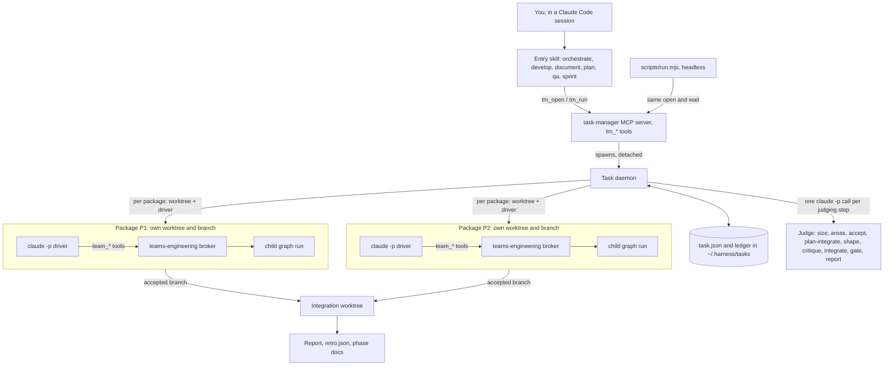
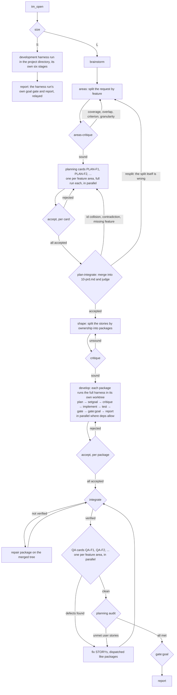
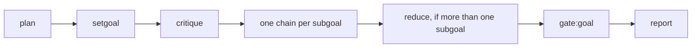
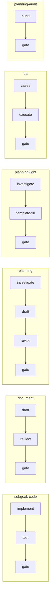
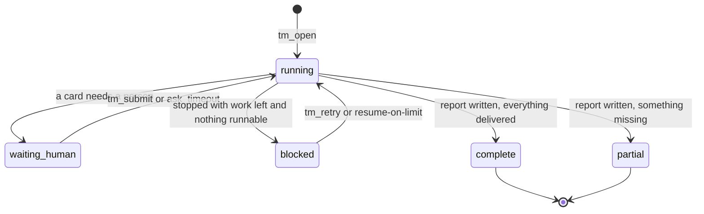

# teams — 한국어

[English](README.md) · **한국어**

`teams`는 요청을 작은 개발팀처럼 처리합니다. 한 번에 끝내기 어려운 요청이면 크기를 재고,
기획하고, **패키지**(작업 단위 하나) 여러 개로 나눈 뒤, 패키지마다 전담 워커를 붙여 각자의 git
워크트리에서 돌립니다. 결과는 모두 심사를 거쳐야 받아들여지고, 받아들여진 브랜치들은 하나의
통합 트리로 합쳐집니다. 그 위에서 QA가 실제로 써 보고, 마지막 목표 게이트가 원래 요청을 정말
충족했는지 판정합니다. 결과가 어떻든 보고서는 남습니다. 큰(size L) 요청은 먼저 PRD와 유저 스토리를
남깁니다. 작은(size S) 요청은 이 과정을 모두 건너뛰고 개발 하네스에 넘겨지며, 하네스가 자체 단계로
계획하고 판정하고 보고합니다.

작업이 여러 조각으로 나뉘거나, 코드만이 아니거나(설계 문서, PRD, QA 패스), 세션을 닫은 뒤에도
계속 돌아야 한다면 `teams`를 쓰세요. 한 세션에서 직접 이끌어 가는 코드 변경 하나라면
[`graph`](../graph/KOR.md)가 맞습니다.

| | `graph` | `teams` |
|---|---|---|
| 잘 맞는 일 | 코드 요청 하나, 런 하나 | 크기를 재고 쪼개야 하는 요청, 문서, PRD, QA, 백로그 |
| MCP 서버 | `graph-engineering` (`graph_*`) | `teams-engineering` (`team_*`) + `task-manager` (`tm_*`) + `teams-wiki` (`wiki_*`) |
| 누가 이끄나 | 내 세션 | 백그라운드 데몬 (세션은 지켜보기만 함) |
| 런 파일 | `.harness-run/broker/` | `.teams_output/broker/` (런), `~/.harness/tasks/` (태스크) |
| 버전 | 1.x | 0.x |

두 플러그인을 한 프로젝트에 함께 켜도 됩니다. 도구 접두사와 런 디렉터리가 서로 다릅니다.

## 전체 구조



- **task-manager**(`mcp/taskmanager.mjs`)는 *태스크*를 관리합니다. 노드 그래프, 패키지,
  워크트리, 판정이 모두 여기 있습니다. 실제 작업은 하지 않고, 자식 런 파일은 읽기만 할 뿐 절대
  쓰지 않습니다.
- **데몬**(`mcp/daemon.mjs`)은 `tm_open`이 띄우며 세션이 끝나도 살아 있습니다. 태스크를 앞으로
  진행시키고, 판단이 필요한 단계마다 일회성 `claude -p` 심사를 호출하고, 죽거나 멈춘 드라이버를
  다시 띄웁니다.
- **드라이버**는 헤드리스 `claude -p` 세션입니다. `teams-engineering` 브로커(`mcp/broker.mjs`,
  `team_*` 도구)를 통해 패키지 하나의 자식 런을 끝까지 몰고 갑니다. 브로커는 `graph`와 같은 엔진
  계보입니다.
- **통합**은 받아들여진 패키지 브랜치들을 별도의 통합 워크트리에 합칩니다. teams는 내 브랜치에
  절대 머지하지 않으므로, 완성된 결과물은 그 통합 트리에 있습니다.

## 태스크 하나의 흐름



단계별로 하는 일:

| 단계 | 하는 일 | 스위치 |
|---|---|---|
| `size` | 심사자가 S(런 하나로 충분)인지 L(쪼개야 함)인지 정합니다. `size` 인자로 고정할 수도 있습니다. 크기 S 태스크는 teams에서 여기서 멈추고 개발 하네스(graph MCP, 없으면 harness 스킬의 Agent Team 폴백)로 넘어갑니다. claude와 codex가 참여하고, 하네스가 자기 단계로 계획·목표 설정·검토·구현·테스트·심사를 합니다. 기획 카드, 분할, shape, worktree, QA 카드는 없습니다. 런에는 태스크 id 태그가 붙고, 런 자신의 goal gate가 `complete`/`partial`을 정하며, 그 리포트가 전달됩니다. | — |
| `brainstorm` | 의도, 범위, 접근을 다시 정리합니다. `interactive`일 때만 사람에게 묻습니다. 세션에서 이미 `decisions`를 넘겼다면 건너뜁니다. | `brainstorm` |
| `areas` | EPIC의 plan 단계가 요청을 **기능** 기준으로 나눕니다. 사용자가 무엇을 할 수 있어야 하는지를 기능 영역으로 묶고, 영역마다 기획 카드가 하나씩 생깁니다. | — |
| `areas-critique` | **신규.** 카드가 돌기 전에 심사자가 분할을 공격합니다: 어느 영역에도 없는 기능, 같은 기능을 두 영역이 기획하는 경우, 사용자 기능이 아니라 모듈·계층으로 자른 영역, 부풀리거나 억지로 합친 영역. 반려되면 결함을 피드백으로 다시 나눕니다. | `max_retries`, `human_gates` |
| 기획 카드 | 기능 영역마다 STORY 카드 하나(`PLAN-F1`, `PLAN-F2`, ...). 카드마다 자기 워크트리에서 전체 런을 돌고, 서로 병렬로 돕니다. 카드는 자기 PRD 섹션(목표, 범위와 비목표, 인수 기준이 달린 유저 스토리 - id는 영역 접두사를 붙인 `F1-US-1` -, 미해결 질문)을 쓰고 유저 스토리를 돌려줍니다. PRD를 쓰지 않았거나, 섹션이 빠졌거나, 유저 스토리가 없거나, 인수 기준 없는 스토리가 있거나, 스토리 id에 카드 접두사가 없으면 반려되고, 반려된 카드는 사유를 달아 다시 돕니다. 요청에 인수 기준이 이미 적혀 있으면 카드마다 가벼운 체인으로 돕니다. | `roles.planning` (`true`, `"light"`, `"auto"`; `false`는 거부) |
| `plan-integrate` | 카드들의 섹션을 `10-prd.md` 하나로 합친 뒤 심사자가 검사합니다. 스토리 id 충돌, 영역 사이의 모순, 요청에 있는데 어느 카드도 다루지 않은 기능. 반려되면 문제가 된 카드를 부족분과 함께 되돌려 보냅니다(빠진 기능은 새 카드를 엽니다). 분할 자체가 틀렸으면 `resplit`을 돌려줍니다. 그러면 카드들은 폐기되고(기록으로 남되 PRD에서는 빠짐) `areas`가 다시 나눕니다. | `max_retries`, `human_gates` |
| `shape` → `critique` | `shape`가 합쳐진 유저 스토리를 이번에는 **소유권** 기준으로 다시 나눠 `touches[]`와 `deps`가 달린 패키지로 만듭니다. 모든 스토리는 어느 패키지든 구현해야 합니다. `critique`가 그 분할을 검토하고, 부실하면 다시 나눕니다. | — |
| 개발 (dispatch) | 실제 개발 단계입니다. 패키지마다 git 워크트리와 드라이버 세션이 붙어 그 패키지의 자식 런을 전체 하네스로 돌립니다: `plan → setgoal → critique → implement → test → gate → gate:goal → report`. 여기서 `plan`은 다시 쪼개는 일이 아니라 그 패키지 하나를 만드는 개발 계획(파일, 인터페이스, 작업 순서, 테스트 계획, 위험)이고, `setgoal`은 패키지의 acceptance를 그대로 옮기며 `critique`가 계획을 그 기준으로 검토합니다. 문서 패키지는 `implement → test → gate` 대신 `draft → review → gate`를 씁니다. `deps`가 풀린 패키지끼리는 병렬로 돕니다. [패키지 하나의 내부](#패키지-하나의-내부) 참고. | `max_parallel_teams`, `vendor` |
| accept | 패키지 런이 끝나면 심사자가 결과를 받아들이거나 반려합니다. 반려되면 사유를 달아 그 패키지를 다시 돌립니다. | `max_retries` |
| `integrate` | 받아들여진 브랜치를 합치고 검사를 돌립니다. 어느 패키지 혼자서는 보이지 않는 이음새 문제는 합쳐진 트리 위에서 일하는 repair 패키지가 맡습니다. | — |
| QA | 기능 영역마다 QA 카드 하나(`QA-F1`, `QA-F2`, ...). 카드마다 합쳐진 트리 위에서 전체 런을 돌며 자기 영역의 유저 스토리를 병렬로 검증합니다. 한 라운드의 카드가 모두 끝나면 결함을 한꺼번에 수정 STORY로 등록하고, 다시 통합한 뒤 모든 QA 카드를 다시 엽니다. 재시도를 다 쓴 카드는 그 카드만 라운드에서 빠지고 라운드 전체가 무너지지는 않습니다. 다른 카드의 결함은 그대로 등록되고, goal gate에는 QA가 검증하지 못한 영역이 전달됩니다. | `roles.qa`, `qa_rounds` |
| audit | 기획 팀이 합쳐진 결과를 합쳐진 PRD와 대조합니다. 충족 못 한 스토리는 QA 결함처럼 등록됩니다. | `roles.audit` |
| `gate:goal` | 결과 전체를 원래 요청에 비춰 판정합니다(`goal_threshold`, 기본 90%). | `goal_threshold` |
| `report` | 목표 게이트가 끝나면 통과든 실패든 항상 돕니다. 다음 스프린트를 위한 `retro.json`도 씁니다. 여기에 끝내지 못한 유저 스토리도 들어갑니다. 스토리는 그것을 구현하는 패키지가 모두 최종 통합에 들어가고 그 통합이 통과해야 "나간" 것으로 칩니다. sub-EPIC은 없으므로 남은 일은 다음 스프린트로 이월됩니다(`tm_open({context_from})`이 `carryover_candidates`로 돌려줌). 열린 질문에는 사람 없이 돈 태스크가 기본값으로 정한 질문도 들어가며, 패키지의 `contradicts_decision`이 맨 앞에 옵니다. 그래서 패키지가 "스펙이 성립하지 않는다"고 한 것을 다음 스프린트 기획이 다룹니다. 스프린트를 연 세션이 이월 항목을 골라 다음 스프린트를 엽니다. 이것이 롱 루프입니다. | — |

모든 반복에는 예산이 있습니다(`max_retries`, `qa_rounds`, `upstream_fix_rounds`). 예산이 바닥나면
그 실패는 *확정(settled)*됩니다. 거기에 기대던 노드는 도달 불가로 표시되고, 태스크는 멈춰 있지
않고 보고서로 넘어갑니다. shape 이전도 같습니다. 분할, 기획 카드, 기획 통합 중 하나가 재시도를
다 쓰면 태스크는 blocked로 남지 않고 보고서와 `retro.json`(카드들이 쓴 PRD 포함)으로 닫힙니다. 비용 한도나 타임박스에 걸렸을 때도 같습니다. 새 패키지는 더 내보내지
않고, 받아들여진 패키지만 통합한 뒤, 나머지는 "Next backlog"로 넘깁니다.

도식에서 뺀 반복이 두 가지 더 있습니다. 통합 *충돌*(두 패키지가 같은 것을 고친 경우)은
`tm_retry({repackage})`로 풀어야 하고, 어떤 패키지가 자신이 의존하는 패키지의 버그를 찾으면
그쪽에 **업스트림 수정**을 등록하고 그 수정을 기다립니다(`upstream_fix_rounds`).

## 패키지 하나의 내부

모든 패키지는 자기 자식 런 안에서 전체 하네스를 돕니다. 태스크가 바깥에서 도는 네 단계(계획,
목표 설정, 검토, 구현과 심사)를 패키지 안에서도 똑같이 돕니다. 기획 카드(`PLAN-F1`, ...), QA 카드(`QA-F1`, ...), audit,
repair 패키지도 같은 모양입니다:



develop 패키지라면 `shape`가 이미 EPIC을 패키지로 나눴고 `critique`가 그 분할을 검토했으므로,
패키지 자신의 `plan`은 이 패키지를 어떻게 만들지에 대한 **개발 계획**입니다: 건드릴 파일과 모듈,
인터페이스와 데이터 형태, 작업 순서, 테스트 계획, 위험. EPIC을 다시 쪼개지 않습니다. `setgoal`은
대개 서브골 하나를 두고 패키지의 acceptance를 스펙에 글자 그대로 옮기며, `critique`는 계획과
스펙을 패키지의 브리프와 acceptance에 비춰 심사합니다. 매니저의 `accept`는 이 패키지의
`gate:goal` 판정과 `report` 인계를 읽습니다. STORY에 건 사람 지정(`tm_assign`, 또는 shape의
`assignee`)은 패키지의 `setgoal`이 만든 모든 서브골에 적용됩니다.

서브골은 그 서브골의 **kind**에 맞는 노드 체인으로 펼쳐집니다(`mcp/graph.mjs`의 `KINDS`).
한 단계를 쓴 쪽이 그 단계를 심사하는 일은 없습니다.



`gate`가 반려하면 그 게이트가 짚은 부족분을 피드백으로 달아 서브골을 다시 돌립니다. interactive
기획 런은 `investigate` 다음에 `ask` 카드를 띄우고 사람을 기다릴 수 있습니다.

어떤 체인을 쓸지는 런의 **flow**가 정합니다. `develop` → code, `document` → document,
`plan` → planning(또는 planning-light), `qa` → qa, 그리고 QA 뒤의 audit → planning-audit입니다.

기획과 QA도 카드로 돌고, 카드는 모두 위와 같은 전체 런입니다. 기획 카드(`PLAN-F1`, ...)는 자기
워크트리에서, QA 카드(`QA-F1`, ...)는 통합 트리에서 돕니다. 태스크 자신도 카드들을 둘러싸고 같은
여섯 단계를 돕니다. `areas`가 태스크의 plan이고, `plan-integrate`, `accept`, `gate:goal`이 게이트입니다.
그래서 어떤 팀도 앞에 계획 없이, 뒤에 게이트 없이 체인만 돌지 않습니다(설계:
[`_repo/docs/plans/2026-09-28-teams-cards-everywhere.md`](../_repo/docs/plans/2026-09-28-teams-cards-everywhere.md)).

## 태스크가 끝나는 방식



| 상태 | 뜻 |
|---|---|
| `running` | 데몬이 작업 중입니다. |
| `waiting_human` | 사람이 처리할 카드가 있습니다. `ask` 질문, `teams:take`로 가져간 단계, `human_gates` 판정 중 하나입니다. `teams:inbox`에서 확인하세요. |
| `blocked` | 할 일이 남았는데 스스로 돌릴 수 있는 것이 없어 멈췄습니다. 재시도 예산 소진, 계속 죽는 드라이버, 사용량 한도 같은 경우입니다. `tm_retry`로 새 시도를 엽니다. |
| `complete` | 보고서가 쓰였고 모든 것이 전달됐습니다. |
| `partial` | **신규.** 보고서는 쓰였지만 전달되지 않은 것이 있습니다. 받아들여지지 않았거나 아예 내보내지 못한 패키지, 실패한 integrate, 판정 없이 끝난 QA나 audit, 통과하지 못한 `gate:goal`, 확정 실패·도달 불가 노드 등입니다. 무엇이 빠졌는지는 `partial_reasons: [...]`에 있습니다. |

## 빠른 시작

**설치.** `teams@newkayak12-claude-skills`를 설치하면 세 MCP 서버가 등록됩니다(`tm_*`/`team_*`/`wiki_*`
도구가 안 보이면 Claude Code를 다시 불러오세요). `teams:install`은 선택입니다. 프로젝트 기본값을
`.claude/team.json`에 고정하고, 디스패치 게이트와 `.claude/conventions/`를 추가합니다. 설치하지
않으면 내장 기본값으로 돕니다. 자세한 내용:
[docs/configuration.KOR.md#설치](docs/configuration.KOR.md#설치).

**실행.** 작업에 맞는 진입 스킬을 고르세요. 어느 것이든 같은 종류의 태스크를 엽니다.

| 스킬 | 쓰는 경우 |
|---|---|
| `teams:orchestrate` | 무엇이든. flow는 엔진이 고릅니다. |
| `teams:develop` | 코드. |
| `teams:document` | 설계 문서, 가이드 같은 글 산출물. |
| `teams:plan` | PRD. |
| `teams:qa` | 기존 결과물에 대한 테스트 케이스 작성과 실행. |
| `teams:sprint` | 우선순위가 매겨진 백로그를 예산이나 타임박스 안에서 돌리고 회고로 마무리. |

관리용 스킬: `teams:install`, `teams:remove`(프로젝트 설정), `teams:patch`(이 저장소 소스의
릴리스 버전 올리기).

**지켜보기.** 직접 몰 필요는 없습니다. 이렇게 지켜보면 됩니다:

| 보고 싶은 것 | 쓰는 것 |
|---|---|
| 전체 EPIC, 또는 EPIC 하나의 STORY 보드 | `teams:board` (`tm_board`) |
| 티켓 하나 (`E-xxxxxxxx`, `E-xxxxxxxx/P2`) | `teams:ticket` (`tm_ticket`) |
| 티켓이 지금 무엇을 하는지 | `teams:log` (`tm_log`) |
| 나를 기다리는 것 | `teams:inbox`, 답은 `teams:submit`, 카드 가져오기는 `teams:take` |
| 브라우저의 실시간 페이지 | `node teams/scripts/view.mjs` (pipeline, tickets, resources 뷰, `--once`는 텍스트 출력) |

티켓은 `Initiative(선택) > EPIC > STORY > TASK` 구조입니다. `I-<slug>`, `E-xxxxxxxx`(태스크),
`E-xxxxxxxx/Pn`(패키지. 기획 카드는 `E-xxxxxxxx/PLAN-F1`, QA 카드는 `E-xxxxxxxx/QA-F1`),
`E-xxxxxxxx/Pn/<subgoal>`(노드 체인).

**헤드리스 / CI.** `scripts/run.mjs`는 세션 없이 태스크를 열고 끝날 때까지 기다립니다:

```
node teams/scripts/run.mjs "<request>" [--kind auto|develop|document] [--size S|L]
  [--budget-usd <n>] [--timebox-minutes <n>] [--json] [--resume-on-limit]
node teams/scripts/run.mjs --resume <task_id>
```

| 종료 코드 | 뜻 |
|---|---|
| `0` | `complete` |
| `3` | `partial`: 보고서는 쓰였으나 전부 전달되지는 않음 |
| `2` | `waiting_human`: 질문이 출력됩니다. `tm_submit`으로 답한 뒤 `--resume` |
| `1` | 그 밖에 멈춘 경우 (`blocked`, 기다려도 풀지 못한 사용량 한도) |
| `64` | 잘못된 인자 |
| `130` | Ctrl-C: 태스크는 데몬에서 계속 돌고, CLI만 지켜보기를 멈춤 |

전체 플래그, `--resume-on-limit` 동작, `--json` 이벤트 스트림:
[docs/configuration.KOR.md#헤드리스](docs/configuration.KOR.md#헤드리스).

## 설정

프로젝트 기본값은 `.claude/team.json`에 둡니다. 우선순위는 내장 기본값 < `team.json` <
`tm_open`/`team_open`에 준 같은 이름의 인자입니다. 모르는 키나 잘못된 값은 무시되고
`tm_status`에 기록됩니다. 스키마는 `mcp/teamconfig.mjs`의 `TEAM_DEFAULTS`입니다. 키별 전체 설명은
[docs/configuration.KOR.md](docs/configuration.KOR.md#설정)에 있습니다.

| 키 | 기본값 | 하는 일 |
|---|---|---|
| `vendor` | `"auto"` | 노드를 돌릴 모델 벤더. |
| `allocation` | `"ordered"` | 노드를 벤더에 배분하는 방식(`"ordered"` 또는 `"balanced"`). |
| `goal_threshold` | `90` | 목표 게이트가 통과시키는 최소 일치율(%). |
| `max_retries` | `2` | 패키지, shape, 서브골별 재시도 횟수. 넘으면 실패가 확정됩니다. |
| `retry_policy` | `"continue"` | 재시도가 실패한 시도의 워크트리 위에서 이어갈지, 먼저 되돌릴지. |
| `roles` | `{planning:"auto", qa:true, audit:true}` | 기획 카드가 어떤 체인을 도는지(`true` 전체, `"light"`, `"auto"`는 인수 기준이 적혀 있으면 가벼운 체인), 그리고 QA 카드와 audit을 돌지. `planning: false`는 거부되고 노트로 남습니다. 기획은 항상 돕니다. |
| `brainstorm` | `true` | `decisions`가 없을 때 엔진이 직접 brainstorm 단계를 돕니다. |
| `interactive` | `false` | 질문, 지정, 사람 게이트가 사람을 기다릴지, 기본값으로 결정할지. |
| `human_gates` | `[]` | 모델 대신 사람이 판정할 심사 단계(`"critique"`, `"accept"`, `"gate:goal"`, `"areas-critique"`, `"plan-integrate"` 등). `plan-integrate`를 거절하는 사람은 `resplit: true`를 함께 보낼 수 있습니다. |
| `ask_timeout` | `null` | 답 없는 `ask` 카드가 기본 답을 택하기까지의 밀리초. `null`이면 무한정 기다립니다. |
| `max_parallel_teams` | `"auto"` | 동시에 돌리는 develop 패키지 수. `"auto"`는 사용량 제한과 크래시에 맞춰 조절합니다. |
| `max_parallel_ceiling` | `null` | `"auto"` 조절기의 상한. `null`이면 CPU 수에서 계산합니다. |
| `driver_restarts` | `2` | 죽은 드라이버를 다시 띄우는 횟수. 넘으면 그 디스패치는 blocked가 됩니다. |
| `restart_period_minutes` | `0` | `driver_restarts`를 이 분 단위 슬라이딩 윈도로 셉니다. `0`이면 전체 기간을 셉니다. |
| `stall_minutes` | `20` | 이만큼 진척 없는 드라이버는 표시하고, 3배가 지나면 죽인 뒤 다시 띄웁니다. `0`이면 끕니다. |
| `budget_usd` | `null` | 태스크 전체 비용 한도. 100%에 이르면 새 작업을 내보내지 않고 보고서로 마무리합니다. |
| `timebox_minutes` | `null` | 같은 멈춤을 `tm_open` 이후 경과 분으로 잽니다. |
| `budget_grace_usd` | `null` | 멈춘 뒤 돌고 있던 디스패치가 죽기 전까지 더 쓸 수 있는 비용(미설정 시 `budget_usd`의 10%). |
| `budget_grace_minutes` | `5` | 멈춘 뒤 돌고 있던 디스패치가 죽기 전까지 더 쓸 수 있는 시간. |
| `qa_rounds` | `2` | QA나 audit 라운드가 수정 STORY를 낼 수 있는 횟수. 넘으면 `unresolved_defects`로 갑니다. |
| `upstream_fix_rounds` | `2` | 패키지 하나에 등록할 수 있는 업스트림 수정 횟수. |
| `docs_dir` | `.teams_output/team` | 페이즈 문서(`INDEX.md`, STORY별 페이지, 보고서)를 쓰는 곳. |
| `plugin_dirs` | `[]` | 모든 드라이버와 심사 세션에 더 넘길 `--plugin-dir` 경로. |
| `initiative` | `null` | 여러 EPIC을 보드에서 묶는 라벨. 표시용일 뿐입니다. |

`goal_judges`와 `auto_reassign`은 호출 인자로만 줄 수 있고 `team.json` 키가 아닙니다.

## 위키 메모리 (teams-wiki)

`teams-wiki`는 이 플러그인의 세 번째 MCP 서버로, 세션보다 오래 가는 프로젝트 메모리입니다. 태스크
엔진과 독립이라 태스크가 위키를 필요로 하지 않고, 위키도 태스크 없이 동작합니다.

페이지는 `.teams_wiki/<space>/<slug>.md`의 마크다운이며 git으로 추적하고 직접 고칠 수 있습니다. 이
파일이 원본입니다. `.teams_wiki/.index.sqlite`(FTS5 검색과 `[[link]]` 그래프)는 버려도 되는 산출물이라,
지우면 다음 호출에서 md 파일로 다시 만듭니다.

| 도구 | 하는 일 |
|---|---|
| `wiki_search` | 페이지 검색(한국어, 영어). |
| `wiki_get` | 페이지 하나와 그 링크, 백링크. |
| `wiki_resume` | 세션 시작용: 최근 `log/*` 페이지와 그 페이지가 링크한 페이지. |
| `wiki_list` | space별 페이지 목록. |
| `wiki_propose` | 제안을 `_proposed/`에 씁니다. 페이지는 아닙니다. |
| `wiki_accept` | 제안을 페이지로 만듭니다. |
| `wiki_reject` | 제안을 사유와 함께 `_rejected/`로 옮깁니다. |
| `wiki_status` | 페이지 수, 대기 중인 제안, 인덱스 최신 여부, 깨진 링크. |

페이지를 직접 쓰는 도구는 없습니다. 모델은 제안만 하고, `wiki_accept`만 게시합니다.

Node 24+가 필요합니다(또는 SQLite에 FTS5가 들어 있는 Node 22/23 빌드). 그 밖의 Node에서는 `wiki_*`
도구가 명확한 오류 하나를 돌려주고, teams의 나머지는 영향이 없습니다.

## Mod (Claude Code 라이브 UI)

teams는 작은 mod를 함께 제공합니다. 현재 세션의 실행을 보여 주는 상태 줄, 토스트, 패널입니다. 얼리 액세스이며 선택 사항입니다. teams의 어떤 동작도 이 mod에 의존하지 않습니다.

**버전.** 모듈은 Claude Code 2.1.292 이상에서 로드됩니다. 모듈 API는 얼리 액세스라 릴리스 사이에 바뀔 수 있습니다. 더 오래된 빌드는 모듈을 건너뜁니다. 2.1.284에서 확인했고, stderr에 한 줄(`hooks module not loaded: …`)만 찍힐 뿐 커맨드 훅, MCP 서버, CLI는 그대로 동작합니다. 설치된 플러그인에 모듈이 켜져 있지 않다는 메시지가 나오면 `CLAUDE_CODE_ENABLE_FUNCTION_HOOKS=1`을 설정하세요.

| 실행 환경 | Mod |
|---|---|
| 대화형 터미널 | 켜짐 |
| 데스크톱 앱, Code 탭 | 켜짐 |
| `claude -p`와 헤드리스 어댑터 | 꺼짐(UI 표면 없음). 아래 `team_status` 가드만 헤드리스에서도 동작 |
| Codex, 또는 플러그인 없음 | 해당 없음, 잃는 것 없음 |

**기능**

- **상태 줄.** `teams: <id> <done>/<total> <current> · …`, 이 세션의 실행마다 한 항목. 실행이 없으면 비어 있습니다.
- 프롬프트 위의 **`[board]` / `[inbox <n>]`**이 패널을 엽니다. 사용자를 기다리는 노드가 `<n>`개일 때 inbox 버튼이 보입니다.
- **`/teams-live`**가 패널을 엽니다. `[tickets]`, `[pipeline]`, `[events]` 탭은 `tm_open`이나 `tm_run`으로 마지막에 시작한 실행을 따라갑니다. 그런 실행이 없으면 이 디렉터리에서 가장 최근에 돌고 있는 작업을 보여 주고, 그것도 없으면 `No teams run in this session.`이 표시됩니다.
- **토스트**는 세션 시작 이후의 이벤트에 뜹니다(`<id8>`은 태스크 id 앞 8자):
  - `E-<id8> <node_id> failed`
  - `E-<id8> needs you: <node_id>`
  - `E-<id8> paused: provider limit`
  - `E-<id8> finished: <state>`
  - `E-<id8> stopped: daemon restarts used up`
  - `E-<id8> <package>: fix rounds used up`
- **`team_status` 가드.** `full: true`이면서 `node_id`가 없는 `team_status`는 `team_status full:true dumps every node; pass node_id or read detail_path (teams:orchestrate NEVER rule)` 메시지로 거부됩니다. 헤드리스 세션에서도 동작합니다.

알려진 제약: UI 표면 없이(헤드리스 또는 SDK 호스팅) 시작한 세션은 나중에 클라이언트가 붙어도 mod가 꺼진 채로 남습니다. 새 세션을 시작해야 켜집니다(바뀌지 않은 mod를 다시 로드해도 session.start는 다시 발생하지 않습니다).

## 더 보기

- [CHANGELOG.KOR.md](CHANGELOG.KOR.md): 모든 릴리스, 최신순.
- [docs/configuration.KOR.md](docs/configuration.KOR.md): 키별 전체 설명, 스프린트 동작
  (`requests`, 인수 기준, 예산, `retro.json`, `context_from`), `view.mjs` 뷰, 헤드리스 세부 사항.
- [`_repo/docs/plans/`](../_repo/docs/plans/)의 설계 문서:
  [`2026-09-11-teams-taskmanager.md`](../_repo/docs/plans/2026-09-11-teams-taskmanager.md)와
  [`2026-09-21-teams-server-owns-the-loop.md`](../_repo/docs/plans/2026-09-21-teams-server-owns-the-loop.md)부터
  읽으세요. 지금의 원칙은
  [`2026-09-28-teams-cards-everywhere.md`](../_repo/docs/plans/2026-09-28-teams-cards-everywhere.md)에 있습니다.
- [`graph/KOR.md`](../graph/KOR.md): 공유하는 브로커 내부(도구, 라우팅, 판정, 벤더, 용량 복구,
  원장). 이 엔진의 수정은 두 플러그인 사이에 옮겨 적용됩니다. teams는
  [`harness`](../harness/KOR.md)의 런타임 게이트 프로토콜에 다른 프로젝트와 똑같이 연동하며, 두
  플러그인 어느 쪽의 베타도 아닙니다.

## 변경 이력

모든 릴리스를 최신순으로: [CHANGELOG.KOR.md](CHANGELOG.KOR.md).
