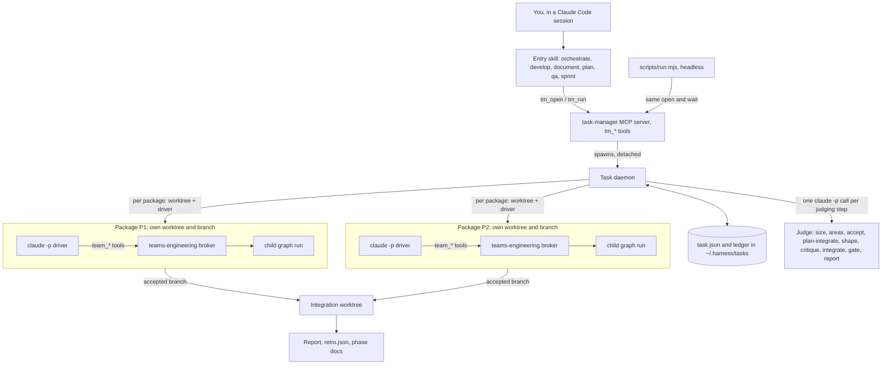
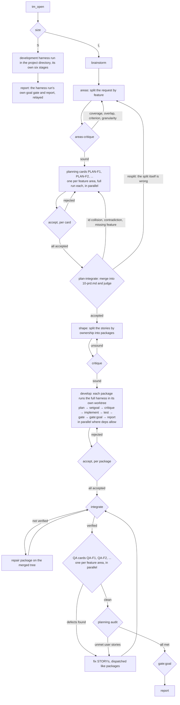
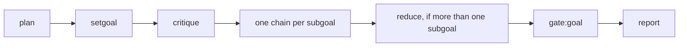
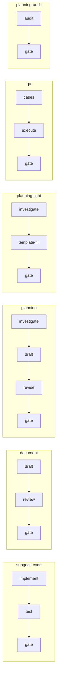
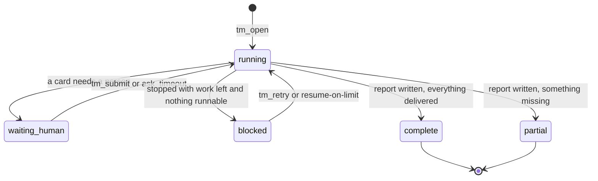

# teams

**English** · [한국어](KOR.md)

`teams` runs a request the way a small software team would. A request that is too big for one
pass is sized, planned, split into **packages** (one per piece of work), and each package is
handed to its own worker in its own git worktree. Every result is judged before it is accepted,
the accepted branches are merged into one integration tree, QA exercises the merged result, and a
final goal gate decides whether the request was actually met. You get a report either way. A
large (size L) request gets a PRD and user stories first. A small (size S) request skips all of
that and is handed to the development harness, which plans, gates and reports it with its own stages.

Use `teams` when the work splits into parts, is not only code (a design doc, a PRD, a QA pass),
or should keep running after you close the session. Use [`graph`](../graph/README.md) for a
single code change you want to drive in one session.

| | `graph` | `teams` |
|---|---|---|
| Good for | one code request, one run | sized/split requests, documents, PRDs, QA, backlogs |
| MCP servers | `graph-engineering` (`graph_*`) | `teams-engineering` (`team_*`) + `task-manager` (`tm_*`) + `teams-wiki` (`wiki_*`) |
| Who drives | your session | a background daemon; your session only watches |
| Run files | `.harness-run/broker/` | `.teams_output/broker/` (runs), `~/.harness/tasks/` (tasks) |
| Version line | 1.x | 0.x |

Both can be enabled in the same project: the tool prefixes and run directories are distinct.

## How it fits together



- **task-manager** (`mcp/taskmanager.mjs`) owns a *task*: its node graph, packages, worktrees
  and verdicts. It never does the work itself, and it reads child run files without ever writing
  them.
- **The daemon** (`mcp/daemon.mjs`) is spawned by `tm_open` and outlives your session. It moves
  the task forward, calls a one-shot `claude -p` judge whenever a step needs judgment, and
  respawns dead or stalled drivers.
- **A driver** is a headless `claude -p` session that drives one package's child run through the
  `teams-engineering` broker (`mcp/broker.mjs`, `team_*` tools). The broker is the same engine
  lineage as `graph`.
- **Integration** merges accepted package branches into a separate integration worktree. teams
  never merges into your own branch; that tree is where the delivered work lives.

## One task, start to finish



What each step does:

| Step | What happens | Switch |
|---|---|---|
| `size` | A judge decides S (one run is enough) or L (split it). You can pin it with `size`. A size-S task stops here in teams: it is handed to the development harness (the graph MCP, or the harness skill's Agent Team fallback), claude and codex taking part, which plans, sets goals, critiques, implements, tests and gates it with its own stages. No planning card, split, shape, worktree or QA card. The run is tagged with the task id; its own goal gate decides `complete` or `partial`, and its report is relayed. | — |
| `brainstorm` | Restates intent, scope and approach; asks you questions only when `interactive`. Skipped when your session already passed `decisions`. | `brainstorm` |
| `areas` | The EPIC's plan stage splits the request by **feature**: what a user must be able to do, grouped into feature areas. Each area becomes a planning card. | — |
| `areas-critique` | **New.** A judge attacks the split before any card runs: a feature in no area, two areas planning the same feature, an area cut by module or layer instead of by what a user does, padded or merged areas. A refusal splits again with the defects as feedback. | `max_retries`, `human_gates` |
| planning cards | One STORY card per feature area (`PLAN-F1`, `PLAN-F2`, ...), each a full run in its own worktree, in parallel. Each writes its PRD section - goal, scope and non-goals, user stories with acceptance criteria (ids prefixed by the area, `F1-US-1`), open questions - and returns its user stories. A card is rejected when it wrote no PRD, a section is missing, it has no user stories, a story has no acceptance criteria, or a story id lacks the card's prefix; a rejected card is retried with the reasons. With acceptance already declared in the request each card runs a lighter chain. | `roles.planning` (`true`, `"light"`, `"auto"`; `false` is refused) |
| `plan-integrate` | Merges every card's section into one `10-prd.md`, then a judge checks it: story ids that collide, areas that contradict each other, a feature the request names that no card covers. A rejection sends the offending cards back with the gaps (or opens a card for the missing feature). When the split itself is wrong it returns `resplit`: the cards are retired (kept as history, out of the PRD) and `areas` splits again. | `max_retries`, `human_gates` |
| `shape` → `critique` | `shape` splits the merged user stories again, this time by **ownership**, into packages with `touches[]` and `deps`; every story must be implemented by some package. `critique` checks the split. An unsound shape is reshaped. | — |
| develop (dispatch) | The actual development. Each package gets its own git worktree and a driver session that runs the package's child run through the full harness: `plan → setgoal → critique → implement → test → gate → gate:goal → report`. `plan` is a build plan for that one package (files, interfaces, order of work, test plan, risks), not a re-split; `setgoal` carries the package's acceptance verbatim and `critique` checks the plan against it. A document package uses `draft → review → gate` in place of `implement → test → gate`. Packages whose `deps` are met run in parallel. See [Inside one package](#inside-one-package). | `max_parallel_teams`, `vendor` |
| accept | When a package's run finishes, a judge accepts or rejects its result. A rejection retries the package with the reasons attached. | `max_retries` |
| `integrate` | Merges the accepted branches and runs the checks. A seam no single package can see gets a repair package that works on the merged tree. | — |
| QA | One QA card per feature area (`QA-F1`, `QA-F2`, ...), each a full run on the merged tree, in parallel, exercising its area's user stories. Once every card of the round has settled, their defects are filed together as fix STORYs, and the loop re-integrates and reopens every QA card. A card that runs out of retries is dropped from the round, not the round with it: its siblings' defects are still filed and the goal gate is told which area QA did not verify. | `roles.qa`, `qa_rounds` |
| audit | Planning checks the merged result against the merged PRD. Unmet stories are filed like QA defects. | `roles.audit` |
| `gate:goal` | Judges the whole result against the original request (`goal_threshold`, default 90%). | `goal_threshold` |
| `report` | Always runs once the goal gate settles, pass or fail. Also writes `retro.json` for the next Sprint, including the user stories that did not ship - a story ships only when every package implementing it is in the final integration, and that integrate passed; there is no sub-EPIC, so unfinished work carries into the next Sprint (`tm_open({context_from})` returns them as `carryover_candidates`). Its open questions include the ones a headless task decided for nobody, a package's `contradicts_decision` first, so the next Sprint's planning takes up a spec a package found could not hold. The session that opened the Sprint picks the carry-over and opens the next one; that is the long loop. | — |

Every loop has a budget (`max_retries`, `qa_rounds`, `upstream_fix_rounds`). When one runs out,
the failure is *settled*: what depends on it is marked unreachable and the task goes on to its
report instead of hanging. That holds before shape too: a split, a planning card or a planning
integrate out of retries closes the task to a report and `retro.json` (with whatever PRD the
cards wrote) instead of leaving it blocked with neither. A budget or timebox stop works the same way: nothing new is
dispatched, the accepted packages are integrated, and the rest is listed as "Next backlog".

Two more loops exist but are left out of the diagram: an integrate *conflict* (two packages
editing the same thing) needs `tm_retry({repackage})`, and a package that finds a bug in a
package it depends on files an **upstream fix** there and waits for it (`upstream_fix_rounds`).

## Inside one package

Every package runs the full harness inside its own child run, the same four steps the task
runs around it (plan, set a goal, check it, build and judge). Planning cards (`PLAN-F1`, ...), QA cards (`QA-F1`, ...), the audit,
and repair packages run the same shape:



For a develop package, `shape` has already split the EPIC and `critique` has already checked
that split, so the package's own `plan` is a **build plan** for this package: the files and
modules to touch, the interfaces and data shapes, the order of work, the test plan and the
risks. It does not split the EPIC again. `setgoal` usually keeps one subgoal and copies the
package's acceptance into the spec word for word; `critique` judges the plan and spec against
the package's brief and acceptance. The package's `gate:goal` verdict and `report` handoff are
what the manager's `accept` reads. A human pin on the STORY (`tm_assign`, or `assignee` in the
shape) applies to every subgoal the package's `setgoal` produces.

Each subgoal expands into a node chain chosen by its **kind** (`KINDS` in `mcp/graph.mjs`).
The author of a stage is never the one who judges it.



A rejected `gate` retries its subgoal with the gate's gaps as feedback. An interactive planning
run can stop after `investigate` with an `ask` card for you.

Which chain a subgoal gets depends on the run's **flow**: `develop` → code, `document` →
document, `plan` → planning (or planning-light), `qa` → qa, and the post-QA audit →
planning-audit.

Planning and QA run on cards, and every card is a full run like this one: a planning card
(`PLAN-F1`, ...) in a worktree of its own, a QA card (`QA-F1`, ...) on the integration tree. The
task itself runs the same six stages around its cards - `areas` is its plan, `plan-integrate`,
`accept` and `gate:goal` are its gates - so no team runs a chain without a plan before it and a
gate after it (design: [`_repo/docs/plans/2026-09-28-teams-cards-everywhere.md`](../_repo/docs/plans/2026-09-28-teams-cards-everywhere.md)).

## How a task ends



| State | Meaning |
|---|---|
| `running` | The daemon is working on it. |
| `waiting_human` | A card needs you: an `ask` question, a stage you took with `teams:take`, or a `human_gates` verdict. See `teams:inbox`. |
| `blocked` | It stopped with work left and nothing it can run on its own, for example a spent retry budget, a driver that kept dying, or a usage limit. `tm_retry` opens a fresh attempt. |
| `complete` | The report is written and everything was delivered. |
| `partial` | **New.** The report is written but something was not delivered: a package not accepted or never dispatched, integrate failed, QA or audit gave no verdict, `gate:goal` did not pass, or nodes were settled/unreachable. `partial_reasons: [...]` says what. |

## Quick start

**Install.** Install `teams@newkayak12-claude-skills`; that registers its three MCP servers (reload
Claude Code if the `tm_*`/`team_*`/`wiki_*` tools do not show). `teams:install` is optional. It pins
project defaults in `.claude/team.json`, adds a dispatch gate, and adds `.claude/conventions/`.
Without it, the built-in defaults apply. Details:
[docs/configuration.md#install](docs/configuration.md#install).

**Run.** Pick the entry skill that matches the work. All of them open the same kind of task.

| Skill | Use for |
|---|---|
| `teams:orchestrate` | Anything; the engine picks the flow. |
| `teams:develop` | Code. |
| `teams:document` | A design doc, guide or other written artifact. |
| `teams:plan` | A PRD. |
| `teams:qa` | Writing and running test cases against existing work. |
| `teams:sprint` | A prioritized backlog under a budget or timebox, ending in a retro. |

Maintenance skills: `teams:install` and `teams:remove` (project setup), `teams:patch` (release
bump for this repository's source).

**Watch.** You do not need to drive anything. Watch with:

| To see | Use |
|---|---|
| Every EPIC, or one EPIC's STORY board | `teams:board` (`tm_board`) |
| One ticket (`E-xxxxxxxx`, `E-xxxxxxxx/P2`) | `teams:ticket` (`tm_ticket`) |
| What a ticket is doing right now | `teams:log` (`tm_log`) |
| What is waiting on you | `teams:inbox`; answer with `teams:submit`; claim a card with `teams:take` |
| A live page in the browser | `node teams/scripts/view.mjs` (pipeline, tickets and resources views; `--once` prints text) |

Tickets follow `Initiative (optional) > EPIC > STORY > TASK`: `I-<slug>`, `E-xxxxxxxx` (the
task), `E-xxxxxxxx/Pn` (a package; also `E-xxxxxxxx/PLAN-F1` for a planning card and
`E-xxxxxxxx/QA-F1` for a QA card), `E-xxxxxxxx/Pn/<subgoal>` (a node chain).

**Headless / CI.** `scripts/run.mjs` opens a task and waits for it with no session in the loop:

```
node teams/scripts/run.mjs "<request>" [--kind auto|develop|document] [--size S|L]
  [--budget-usd <n>] [--timebox-minutes <n>] [--json] [--resume-on-limit]
node teams/scripts/run.mjs --resume <task_id>
```

| Exit | Meaning |
|---|---|
| `0` | `complete` |
| `3` | `partial`: report written, not everything delivered |
| `2` | `waiting_human`: the question is printed; answer it with `tm_submit`, then `--resume` |
| `1` | anything else that stopped (`blocked`, a usage limit it could not wait out) |
| `64` | bad arguments |
| `130` | Ctrl-C: the task keeps running in its daemon; the CLI only stops watching |

All flags, the `--resume-on-limit` behaviour and the `--json` event stream:
[docs/configuration.md#headless](docs/configuration.md#headless).

## Configuration

Put project defaults in `.claude/team.json`. The order is built-in default < `team.json` <
an argument of the same name on `tm_open`/`team_open`. An unknown key or a bad value is ignored
and noted in `tm_status`. The schema is `TEAM_DEFAULTS` in `mcp/teamconfig.mjs`. The full
explanation of every key is in [docs/configuration.md](docs/configuration.md#configuration).

| Key | Default | What it does |
|---|---|---|
| `vendor` | `"auto"` | Which model vendor runs the nodes. |
| `allocation` | `"ordered"` | How nodes are routed across vendors (`"ordered"` or `"balanced"`). |
| `goal_threshold` | `90` | Minimum match % for a goal gate to accept. |
| `max_retries` | `2` | Retries per package, shape and subgoal before the failure is settled. |
| `retry_policy` | `"continue"` | Whether a retry builds on the failed attempt's worktree or rolls it back first. |
| `roles` | `{planning:"auto", qa:true, audit:true}` | Which chain the planning cards run (`true` full, `"light"`, `"auto"` light when acceptance is declared), and whether the QA cards and the audit run. `planning: false` is refused with a note: planning always runs. |
| `brainstorm` | `true` | Runs the engine's own brainstorm step when no `decisions` were passed. |
| `interactive` | `false` | Whether questions, pins and human gates wait for a person or are decided by default. |
| `human_gates` | `[]` | Judging stages (`"critique"`, `"accept"`, `"gate:goal"`, `"areas-critique"`, `"plan-integrate"`, ...) that a person decides instead of a model. A person refusing `plan-integrate` may pass `resplit: true`. |
| `ask_timeout` | `null` | Milliseconds before an unanswered `ask` card takes its default answer; `null` waits forever. |
| `max_parallel_teams` | `"auto"` | How many develop packages run at once; `"auto"` adapts to rate limits and crashes. |
| `max_parallel_ceiling` | `null` | Upper limit for the `"auto"` controller; `null` derives one from the CPU count. |
| `driver_restarts` | `2` | How many times a dead driver is respawned before its dispatch is marked blocked. |
| `restart_period_minutes` | `0` | Counts `driver_restarts` in a sliding window of this many minutes; `0` counts forever. |
| `stall_minutes` | `20` | A driver idle this long is flagged, and after 3x this long it is killed and respawned; `0` disables this. |
| `budget_usd` | `null` | Spend cap for the whole task; at 100% nothing new is dispatched and the task closes to its report. |
| `timebox_minutes` | `null` | The same stop, measured in minutes since `tm_open`. |
| `budget_grace_usd` | `null` | Extra spend a running dispatch may use after the stop before it is killed (10% of `budget_usd` when unset). |
| `budget_grace_minutes` | `5` | Extra time a running dispatch may use after the stop before it is killed. |
| `qa_rounds` | `2` | How many QA or audit rounds may file fix STORYs; further defects go to `unresolved_defects`. |
| `upstream_fix_rounds` | `2` | How many upstream fixes may be filed against one package. |
| `docs_dir` | `.teams_output/team` | Where the phase documents (`INDEX.md`, per-STORY pages, report) are written. |
| `plugin_dirs` | `[]` | Extra `--plugin-dir` paths for every driver and judge session. |
| `initiative` | `null` | A label that groups several EPICs on the board; display only. |

`goal_judges` and `auto_reassign` are call arguments only, not `team.json` keys.

## Wiki memory (teams-wiki)

`teams-wiki` is a third MCP server in this plugin: project memory that outlives a session. It is
independent of the task engine, so a task does not need it and it does not need a task.

Pages are markdown under `.teams_wiki/<space>/<slug>.md`, git-tracked and hand-editable; that is the
source. `.teams_wiki/.index.sqlite` (FTS5 search plus the `[[link]]` graph) is disposable: delete it
and the next call rebuilds it from the md files.

| Tool | What it does |
|---|---|
| `wiki_search` | Search pages (Korean and English). |
| `wiki_get` | One page with its links and backlinks. |
| `wiki_resume` | Session start: the most recent `log/*` pages and the pages they link to. |
| `wiki_list` | Pages grouped by space. |
| `wiki_propose` | Write a proposal to `_proposed/`; never a page. |
| `wiki_accept` | Turn a proposal into a page. |
| `wiki_reject` | Move a proposal to `_rejected/` with the reason. |
| `wiki_status` | Page count, pending proposals, index freshness, broken links. |

Nothing writes a page directly: a model proposes, and only `wiki_accept` publishes.

Needs Node 24+, or a Node 22/23 build whose SQLite includes FTS5. On any other Node the `wiki_*`
tools return one clear error and the rest of teams is unaffected.

## Mod (Claude Code live UI)

teams ships a small mod: a status line, toasts and a pane for the runs of the current session. It is early access and optional. Nothing in teams depends on it.

**Version.** Modules load on Claude Code 2.1.292 and newer. The module API is early access and may change between releases. An older build skips the module: 2.1.284 was checked, it prints one stderr line (`hooks module not loaded: …`) and the command hooks, MCP server and CLIs work unchanged. If a build says modules are not turned on for installed plugins, set `CLAUDE_CODE_ENABLE_FUNCTION_HOOKS=1`.

| Where it runs | Mod |
|---|---|
| Interactive terminal | on |
| Desktop app, Code tab | on |
| `claude -p` and headless adapters | off (no UI surface), except the `team_status` guard below, which runs headless too |
| Codex, or no plugin | not applicable, nothing is lost |

**Features**

- **Status line.** `teams: <id> <done>/<total> <current> · …`, one entry per run of this session; empty when nothing runs.
- **`[board]` / `[inbox <n>]`** above the prompt open the pane; the inbox button shows when `<n>` nodes wait for you.
- **`/teams-live`** opens the pane. Tabs `[tickets]`, `[pipeline]`, `[events]` follow the last run you started with `tm_open` or `tm_run`. With none, it shows the newest running task of this directory; with neither, `No teams run in this session.`
- **Toasts** for events after the session started (`<id8>` is the first 8 characters of the task id):
  - `E-<id8> <node_id> failed`
  - `E-<id8> needs you: <node_id>`
  - `E-<id8> paused: provider limit`
  - `E-<id8> finished: <state>`
  - `E-<id8> stopped: daemon restarts used up`
  - `E-<id8> <package>: fix rounds used up`
- **`team_status` guard.** `team_status` with `full: true` and no `node_id` is denied with `team_status full:true dumps every node; pass node_id or read detail_path (teams:orchestrate NEVER rule)`. This runs in headless sessions too.

Known limitation: a session that started with no UI surface (headless or SDK-hosted) keeps the mod off even if a client attaches later; start a new session to get it (a reload of an unchanged mod does not re-fire session.start).

## More

- [CHANGELOG.md](CHANGELOG.md): every release, newest first.
- [docs/configuration.md](docs/configuration.md): full per-key reference, Sprint mechanics
  (`requests`, acceptance, budget, `retro.json`, `context_from`), `view.mjs` views, headless
  details.
- Design docs in [`_repo/docs/plans/`](../_repo/docs/plans/): start with
  [`2026-09-11-teams-taskmanager.md`](../_repo/docs/plans/2026-09-11-teams-taskmanager.md) and
  [`2026-09-21-teams-server-owns-the-loop.md`](../_repo/docs/plans/2026-09-21-teams-server-owns-the-loop.md);
  the current principles are in
  [`2026-09-28-teams-cards-everywhere.md`](../_repo/docs/plans/2026-09-28-teams-cards-everywhere.md).
- [`graph/README.md`](../graph/README.md): the shared broker internals (tools, routing,
  adjudication, vendors, capacity recovery, the ledger). Fixes to that engine are ported
  between the two plugins. teams plugs into [`harness`](../harness/README.md)'s runtime gate
  protocol the same way any project can; it is not a beta of either plugin.

## Changelog

Every release, newest first: [CHANGELOG.md](CHANGELOG.md).
